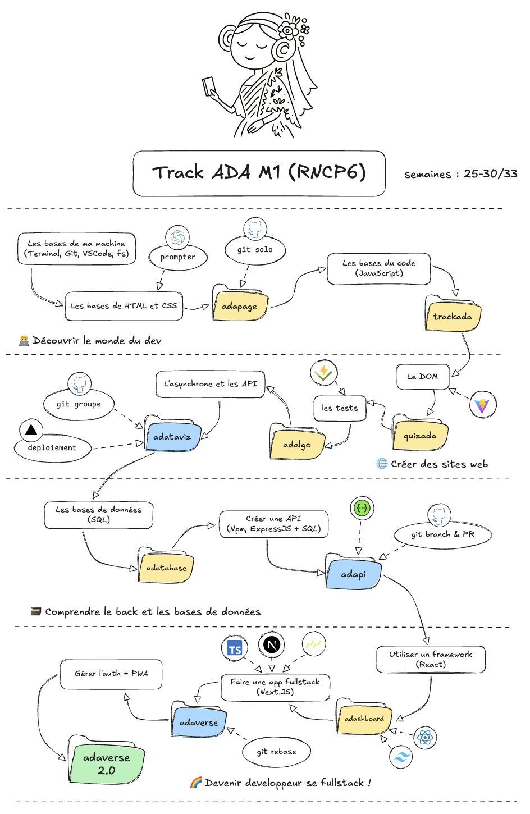

# Ada - New tack

Le but de ce repository est de servir de réference de l'ensemble du contenu et des supports de la track de formation Ada.

## Arborescence

-   **guides** contient l'ensemble des guides permettant d'expliquer aux apprenantes certains concepts, ou process ainsi que les rituels de la formation (soutenances, démos, etc.)
-   **projects** contient les sujets des différents projets de la formation
-   **exercices** contient l'ensemble des exercices à partager aux apprenantes, rangés par arc de formation
