# Immersion_HTML

Ce README fournit la correction d'un exercice portant sur le développement HTML et CSS. L'exercice consistait à créer une page web selon certaines spécifications données, en utilisant HTML pour la structure et CSS pour la mise en forme.

voici la construction des corrections proposer :

- Immersion HTML 01 => notion de base
- Immersion HTML 02 => manipulation des balises plus avancés
- Immersion HTML 03 => manipulation des images
- Immersion HTML 04 => responsive

---

### Immersion_HTML 01

---

#### html_world

cette correction contient un fichier nommé html_world.html

lorsqu'elle est ouverte dans un navigateur nous pouvons observer ce resultat

#### html_world_italic

cette correction contient un fichier nommé html_world_italic.html

lorsqu'elle est ouverte dans un navigateur nous pouvons observer ce resultat

#### html_world_rainbow

cette correction contient un fichier nommé html_world_rainbow.html lié à un fichier nommé application.css

lorsqu'elle est ouverte dans un navigateur nous pouvons observer ce resultat

#### red_square

cette correction contient un fichier nommé red_square.html lié à un fichier nommé application.css

le carré fait du 30px x 30px

lorsqu'elle est ouverte dans un navigateur nous pouvons observer ce resultat

#### rainbow_squares

cette correction contient un fichier nommé rainbow_squares.html lié à un fichier nommé application.css

les carrés fait du 30px x 30px

lorsqu'elle est ouverte dans un navigateur nous pouvons observer ce resultat

#### spaced_squares

cette correction contient un fichier nommé spaced_squares.html lié à un fichier nommé application.css

les carrés fait du 30px x 30px et chacun à un espace de 15px

lorsqu'elle est ouverte dans un navigateur nous pouvons observer ce resultat

#### diagonal_squares

cette correction contient un fichier nommé diagonal_squares.html lié à un fichier nommé application.css

les carrés fait du 30px x 30px et chacun à un espace de 15px

lorsqu'elle est ouverte dans un navigateur nous pouvons observer ce resultat

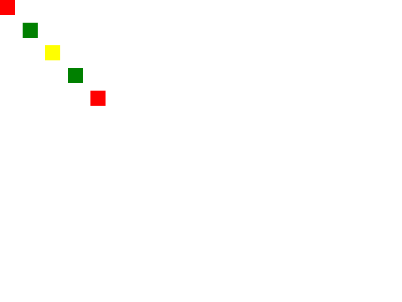

#### abstract_art

cette correction contient un fichier nommé diagonal_squares.html lié à un fichier nommé application.css

l'objectif de cette exercice est de jouer avec les positions et le z-index

lorsqu'elle est ouverte dans un navigateur nous pouvons observer ce resultat

---

### Immersion_HTML 02

---

#### html_input

cette correction contient un fichier nommé html_input.html

lorsqu'elle est ouverte dans un navigateur nous pouvons observer ce resultat

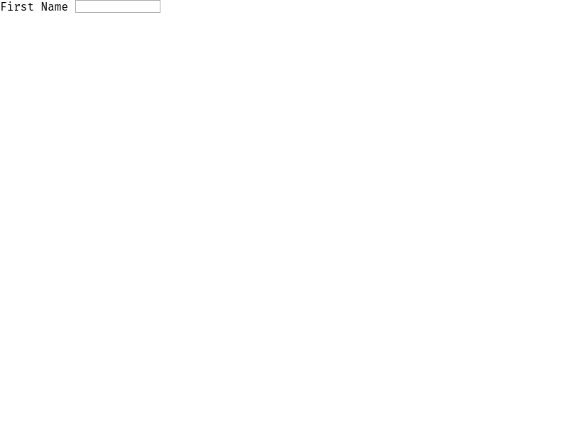

#### html_form

cette correction contient un fichier nommé html_form.html

lorsqu'elle est ouverte dans un navigateur nous pouvons observer ce resultat

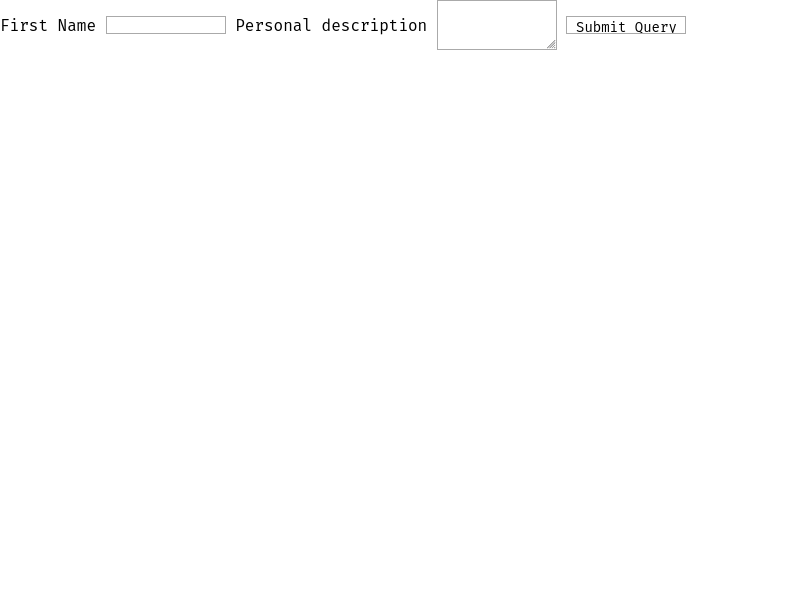

#### aligned_form

cette correction contient un fichier nommé aligned_form.html lié à un fichier application.css

le formulaire a une largeur de 200px
L'espace entre une étiquette et son champ de saisie est de 10px. L'espace entre deux champs différents est de 20px.

lorsqu'elle est ouverte dans un navigateur nous pouvons observer ce resultat

#### html_table

cette correction contient un fichier nommé html_table.html lié à un fichier application.css

lorsqu'elle est ouverte dans un navigateur nous pouvons observer ce resultat

#### html_table

cette correction contient un fichier nommé html_table.html lié à un fichier application.css

lorsqu'elle est ouverte dans un navigateur nous pouvons observer ce resultat

#### bordered_table

cette correction contient un fichier nommé bordered_table.html lié à un fichier application.css

lorsqu'elle est ouverte dans un navigateur nous pouvons observer ce resultat

#### spaced_table

cette correction contient un fichier nommé spaced_table.html lié à un fichier application.css

L'espace entre les éléments sera de 5px

lorsqu'elle est ouverte dans un navigateur nous pouvons observer ce resultat

#### html_form_hard

cette correction contient un fichier nommé spaced_table.html lié à un fichier application.css

lorsqu'elle est ouverte dans un navigateur nous pouvons observer ce resultat

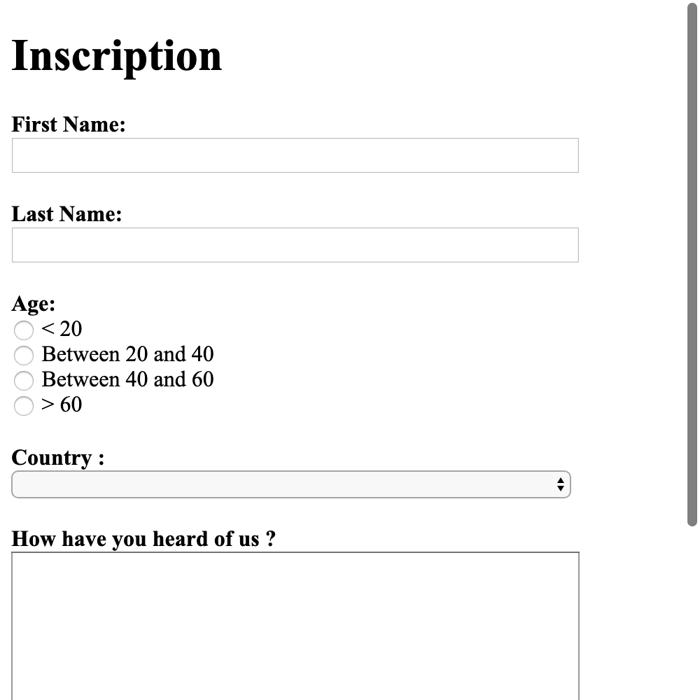

---

### Immersion_HTML 03

---

#### small_gallery

cette correction contient un fichier nommé small_gallery.html lié à un fichier application.css

lorsqu'elle est ouverte dans un navigateur nous pouvons observer ce resultat

#### medium_gallery

cette correction contient un fichier nommé medium_gallery.html lié à un fichier application.css

l'espace entre les images et le titre est de 5px
l'espace entre les éléments est de 10px

lorsqu'elle est ouverte dans un navigateur nous pouvons observer ce resultat

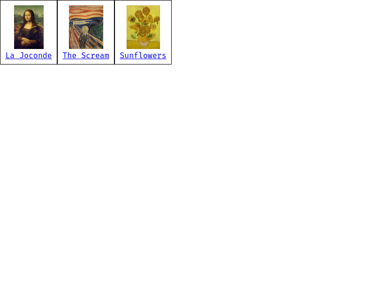

#### big_gallery

cette correction contient un fichier nommé big_gallery.html lié à un fichier application.css

l'espace entre les images et le titre est de 5px
l'espace entre deux éléments est de 20px

lorsqu'elle est ouverte dans un navigateur nous pouvons observer ce resultat

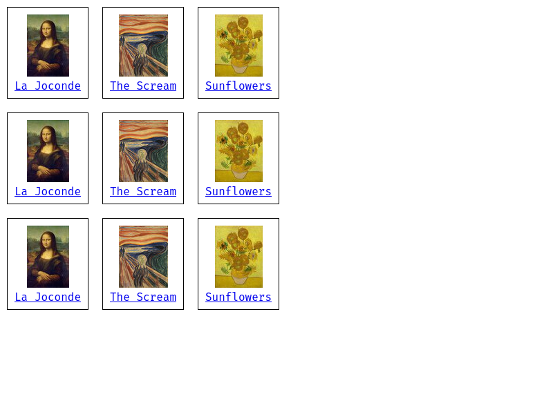

#### newspaper

cette correction contient un fichier nommé newspaper.html lié à un fichier application.css

lorsqu'elle est ouverte dans un navigateur nous pouvons observer ce resultat

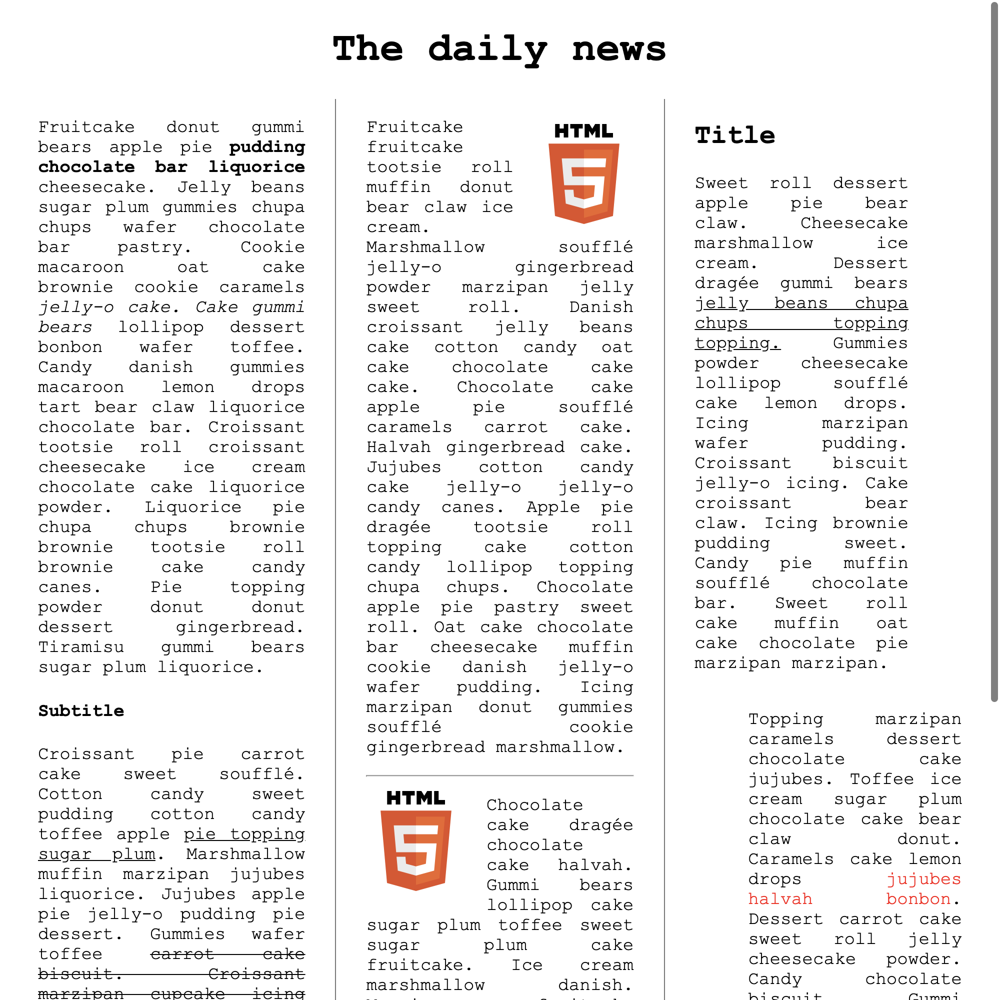

---

### Immersion_HTML 04

---

#### first_flex

cette correction contient un fichier nommé first_flex.html lié à un fichier application.css

la page contient 3 carrés avec une dimension de 20px x 20px

lorsqu'elle est ouverte dans un navigateur nous pouvons observer ce resultat

#### small_media_query

cette correction contient un fichier nommé small_media_query.html lié à un fichier application.css

la page contient un titre qui change de couleur en fonction de la dimension de la page

lorsqu'elle est ouverte dans un navigateur nous pouvons observer ce resultat

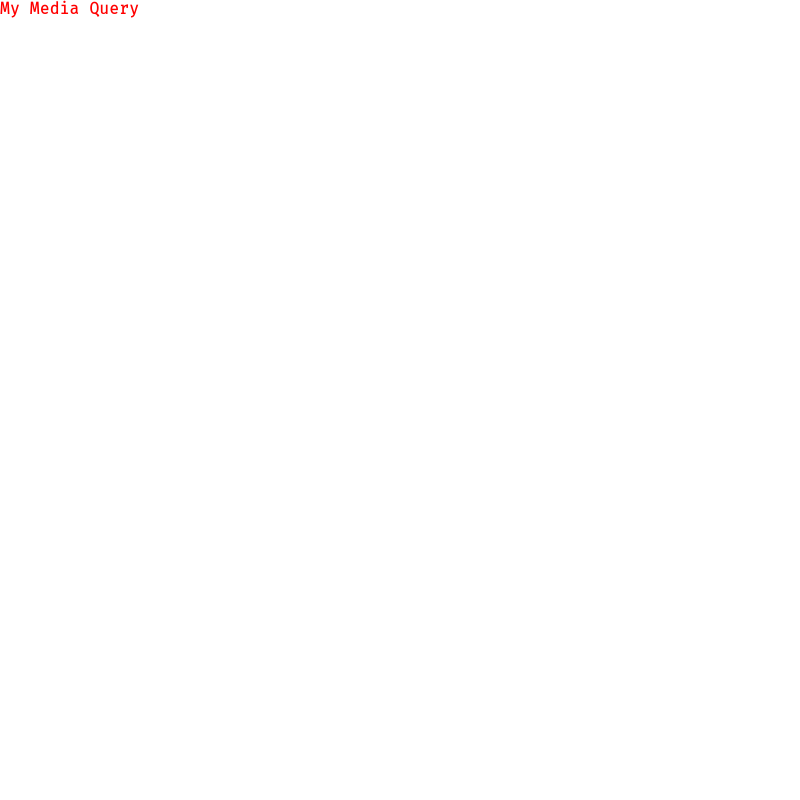
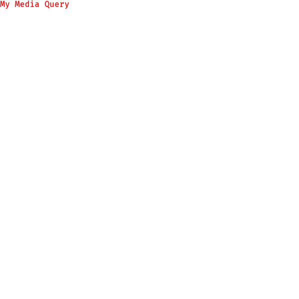
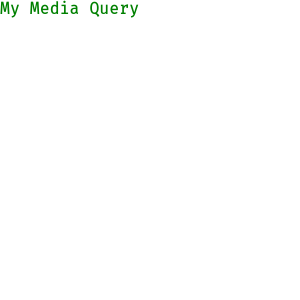

#### small_grid

cette correction contient un fichier nommé small_grid.html lié à un fichier application.css

la page contient 5 blocks avec une largeur de 50px avec une bordure de 1px et un background jaune

lorsqu'elle est ouverte dans un navigateur nous pouvons observer ce resultat

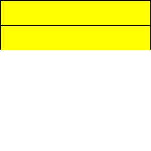
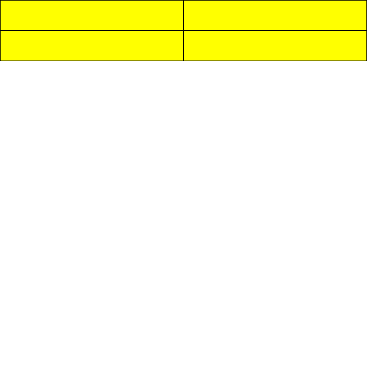
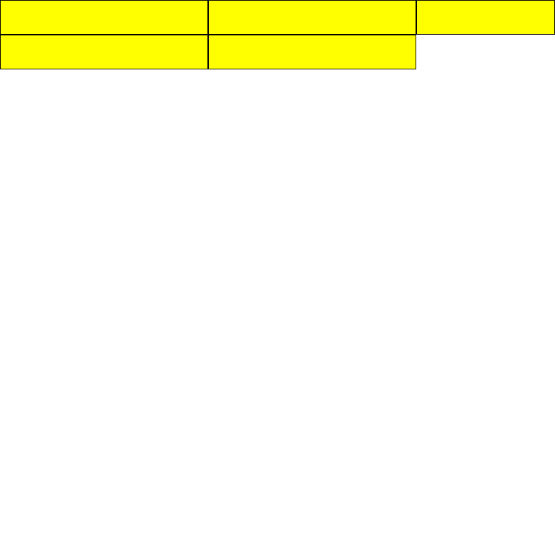

#### medium_flex

cette correction contient un fichier nommé medium_flex.html lié à un fichier application.css

la page contient 3 carrés avec une dimension de 20px x 20px

lorsqu'elle est ouverte dans un navigateur nous pouvons observer ce resultat

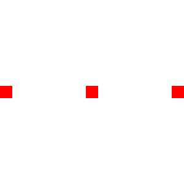

#### medium_media_query

cette correction contient un fichier nommé medium_media_query.html lié à un fichier application.css

la page contient un titre qui change de couleur en fonction de la dimension de la page

lorsqu'elle est ouverte dans un navigateur nous pouvons observer ce resultat

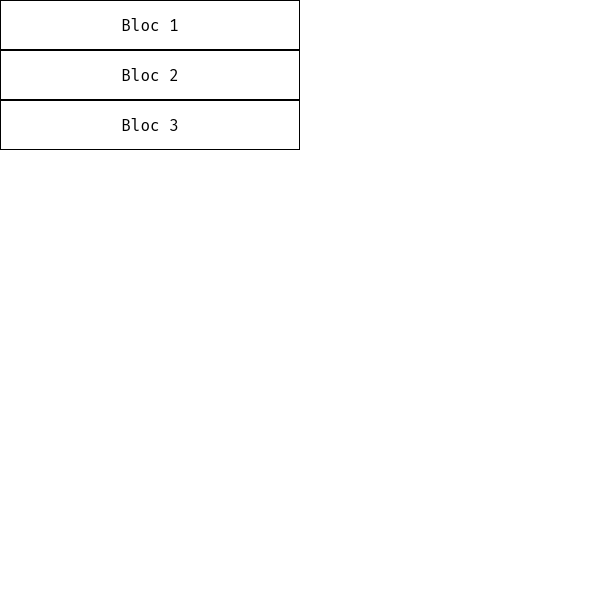
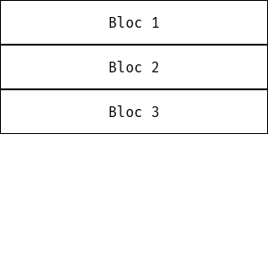

#### medium_grid

cette correction contient un fichier nommé medium_grid.html lié à un fichier application.css

la page contient 5 blocks avec une largeur de 50px avec une bordure de 1px et un background jaune

lorsqu'elle est ouverte dans un navigateur nous pouvons observer ce resultat

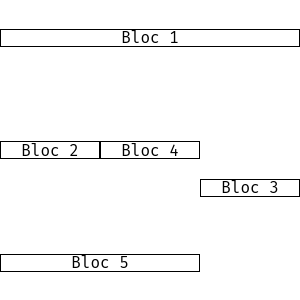
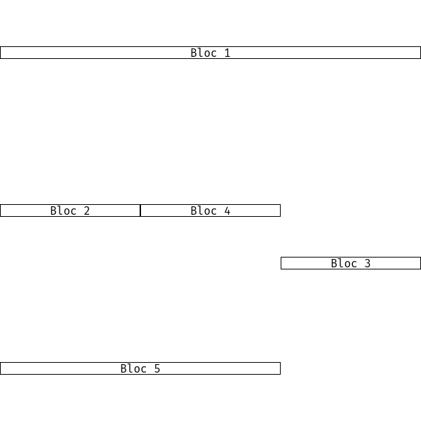

#### big_flex

cette correction contient un fichier nommé medium_flex.html lié à un fichier application.css

la page contient 3 carrés avec une dimension de 200px x 200px

lorsqu'elle est ouverte dans un navigateur nous pouvons observer ce resultat

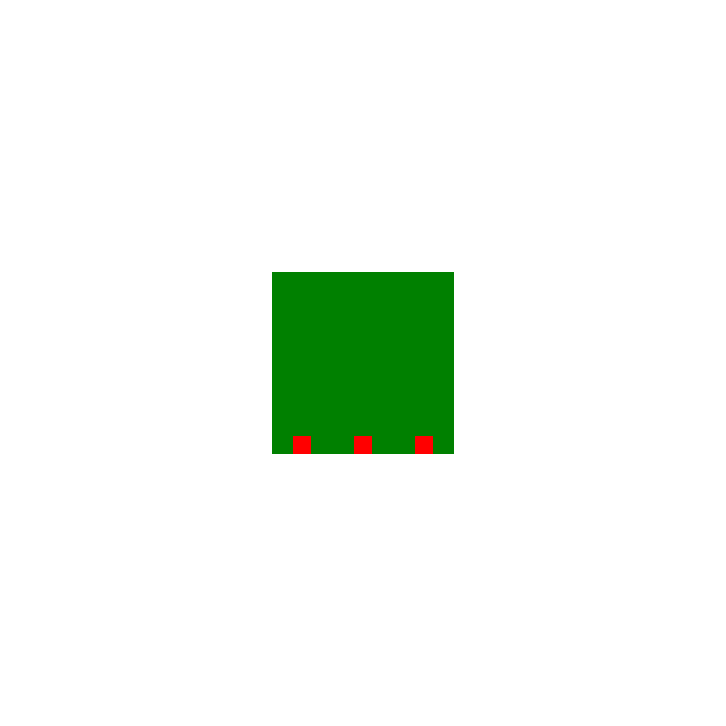
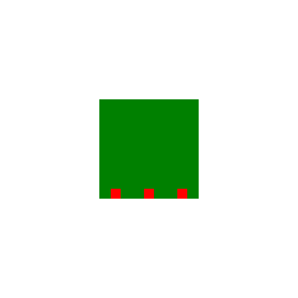
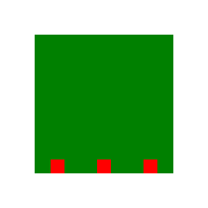

#### big_media_query

cette correction contient un fichier nommé medium_media_query.html lié à un fichier application.css

la page contient un titre qui change de couleur en fonction de la dimension de la page

lorsqu'elle est ouverte dans un navigateur nous pouvons observer ce resultat

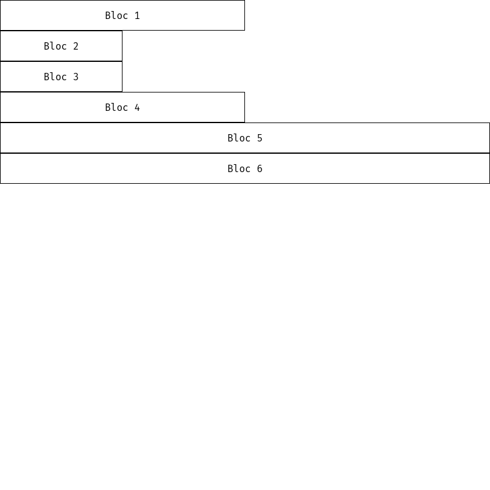
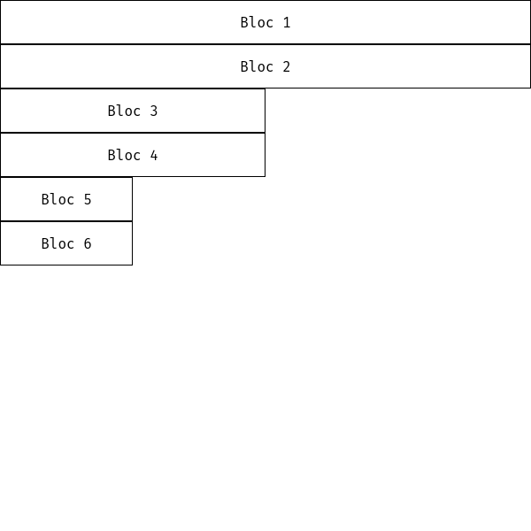
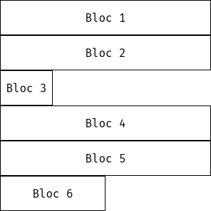

#### big_grid

cette correction contient un fichier nommé medium_grid.html lié à un fichier application.css

la page contient 5 blocks avec une largeur de 50px avec une bordure de 1px et un background jaune

lorsqu'elle est ouverte dans un navigateur nous pouvons observer ce resultat

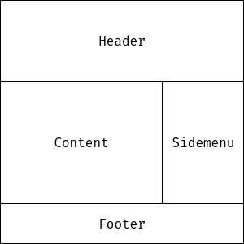
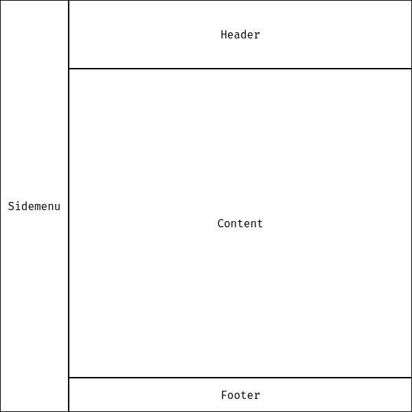
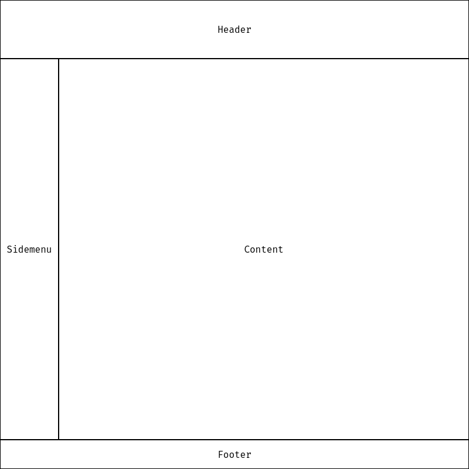
