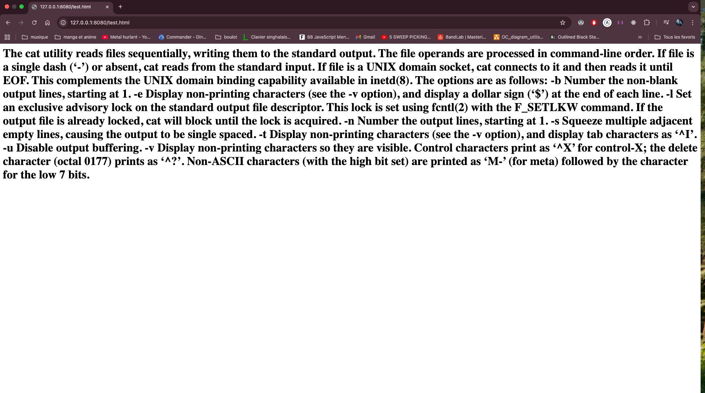

# Exercice

⚠️ **Tous les exercices doivent être exécutés via le terminal** ⚠️

## Exercice 1 – Où es-tu ?

Affiche le chemin absolu du dossier courant.

Exemple attendu :

```bash
/Users/ton-nom/ada
```

---

## Exercice 2 – Que contient le dossier ?

Crée un fichier nommé `commande-terminal.md` et vérifie la liste des fichiers du dossier courant.

Exemple attendu :

```bash
total 0
drwxr-xr-x  3 karlos  staff   96 25 déc 17:03 .
drwxr-xr-x  4 karlos  staff  128 25 déc 17:02 ..
-rw-r--r--  1 karlos  staff    0 25 déc 17:03 commande-terminal.md
```

---

## Exercice 3 – Crée des dossiers

Crée deux dossiers vides appelés `exercices` et `projets` puis liste le contenu du répertoire.

Exemple attendu :

```bash
total 0
drwxr-xr-x  5 karlos  staff  160 25 déc 17:06 .
drwxr-xr-x  4 karlos  staff  128 25 déc 17:02 ..
-rw-r--r--  1 karlos  staff    0 25 déc 17:03 commande-terminal.md
drwxr-xr-x  2 karlos  staff   64 25 déc 17:06 exercices
drwxr-xr-x  2 karlos  staff   64 25 déc 17:06 projets
```

---

## Exercice 4 – Déplace-toi

Va dans ton dossier `exercices` et déplace le fichier `commande-terminal.md` dans ce dossier.

Si tu affiches le contenu de ton dossier `exercices`, tu devrais avoir ceci :

```bash
drwxr-xr-x  3 karlos  staff   96 25 déc 17:10 .
drwxr-xr-x  4 karlos  staff  128 25 déc 17:10 ..
-rw-r--r--  1 karlos  staff    0 25 déc 17:03 commande-terminal.md
```

---

## Exercice 5 – Créer une copie (fichier)

Maintenant que nous savons déplacer notre fichier, faisons une copie dans le dossier `projets`.

Nous devrions avoir ceci

```bash
/Users/karlos/ada/ada/exercices
total 0
drwxr-xr-x  3 karlos  staff   96 25 déc 17:10 .
drwxr-xr-x  4 karlos  staff  128 25 déc 17:10 ..
-rw-r--r--  1 karlos  staff    0 25 déc 17:03 commande-terminal.md

/Users/karlos/ada/ada/projets
total 0
drwxr-xr-x  3 karlos  staff   96 25 déc 17:18 .
drwxr-xr-x  4 karlos  staff  128 25 déc 17:10 ..
-rw-r--r--  1 karlos  staff    0 25 déc 17:18 commande-terminal.md
```

---

## Exercice 7 – Créer une copie (dossier)

Nous savons copier un fichier, faisons maintenant la même chose avec un dossier. Copions le dossier `exercices` dans `projets`.

Voici le résultat attendu :

```bash
/Users/karlos/ada/ada/projets
total 0
drwxr-xr-x  4 karlos  staff  128 25 déc 17:27 .
drwxr-xr-x  4 karlos  staff  128 25 déc 17:10 ..
-rw-r--r--  1 karlos  staff    0 25 déc 17:26 commande-terminal.md
drwxr-xr-x  3 karlos  staff   96 25 déc 17:27 exercices

/Users/karlos/ada/ada/projets/exercices
total 0
drwxr-xr-x  3 karlos  staff   96 25 déc 17:27 .
drwxr-xr-x  4 karlos  staff  128 25 déc 17:27 ..
-rw-r--r--  1 karlos  staff    0 25 déc 17:27 commande-terminal.md
```

---

## Exercice 8 - Supprimer un fichier

Supprimons le fichier `commande-terminal.md` se trouvant dans le dossier `projets`

```bash
# avant suppression
/Users/karlos/ada/ada/projets/exercices
total 0
drwxr-xr-x  3 karlos  staff   96 25 déc 17:27 .
drwxr-xr-x  4 karlos  staff  128 25 déc 17:27 ..
-rw-r--r--  1 karlos  staff    0 25 déc 17:27 commande-terminal.md

# après suppression
/Users/karlos/ada/ada/projets/exercices
total 0
drwxr-xr-x  2 karlos  staff   64 25 déc 17:31 .
drwxr-xr-x  4 karlos  staff  128 25 déc 17:27 ..
```

---

## Exercice 9 - Supprimer un dossier et un fichier

Maintenant que nous avons supprimé le contenu du dossier `exercices`, nous allons le supprimer ainsi que le fichier `commande-terminal.md`.

Nous devrions obtenir un résultat similaire à ceci :

```bash
# avant suppression
/Users/karlos/ada/ada/projets
total 0
drwxr-xr-x  4 karlos  staff  128 25 déc 17:27 .
drwxr-xr-x  4 karlos  staff  128 25 déc 17:10 ..
-rw-r--r--  1 karlos  staff    0 25 déc 17:26 commande-terminal.md
drwxr-xr-x  2 karlos  staff   64 25 déc 17:31 exercices

# après suppression
/Users/karlos/ada/ada/projets
total 0
drwxr-xr-x  2 karlos  staff   64 25 déc 17:31 .
drwxr-xr-x  4 karlos  staff  128 25 déc 17:27 ..
```

---

## Exercice 10 – Remplir le fichier

Retourne dans le dossier `exercices` et ouvre le fichier `commande-terminal.md`. Écris les commandes directement dans le terminal.

Nous devrions avoir ceci :

```bash
# avant intégration
total 0
drwxr-xr-x  3 karlos  staff   96 25 déc 17:44 .
drwxr-xr-x  4 karlos  staff  128 25 déc 17:10 ..
-rw-r--r--  1 karlos  staff    0 25 déc 17:44 commande-terminal.md

# après intégration
total 8
drwxr-xr-x  3 karlos  staff   96 25 déc 17:45 .
drwxr-xr-x  4 karlos  staff  128 25 déc 17:10 ..
-rw-r--r--  1 karlos  staff   21 25 déc 17:45 commande-terminal.md
```

## Exercice 11 – Renommer le fichier

Changeons le nom du fichier, passons de `commande-terminal.md` à `instruction-terminal.md`.

(indice : elle peut vous permettre de vous déplacer)

```bash
# avant modification
/Users/karlos/ada/ada/exercices
total 8
drwxr-xr-x  3 karlos  staff   96 25 déc 17:45 .
drwxr-xr-x  4 karlos  staff  128 25 déc 17:10 ..
-rw-r--r--  1 karlos  staff   21 25 déc 17:45 commande-terminal.md

# après modification
/Users/karlos/ada/ada/exercices
total 8
drwxr-xr-x  3 karlos  staff   96 25 déc 17:45 .
drwxr-xr-x  4 karlos  staff  128 25 déc 17:10 ..
-rw-r--r--  1 karlos  staff   21 25 déc 17:45 instruction-terminal.md
```

## Exercice 12 – Vérification

Nous allons vérifier le contenu du fichier `instruction-terminal.md`.

# Bonus

⚠️ **Ne faites ces exercices que si vous avez terminé tous les autres exercices demandés auparavant et que vous les avez postés sur GitHub** ⚠️

## Exercice 13 - Cat instruction

Nous allons récupérer les instructions de `cat` en ne prenant que la description pour ensuite les mettre dans un fichier `cat_instruction.txt`.

---

## Exercice 14 - Cat en balise HTML

Maintenant que nous avons les instructions de `cat`, nous allons créer un second fichier appelé `cat-balise`, qui contiendra les mêmes instructions mais dans un format différent.

Nous devrions obtenir ce résultat :


Pensez à utiliser la commande suivante :

```bash
npx live-server
```
