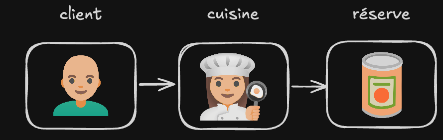
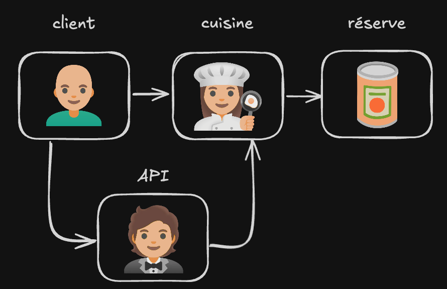

# Back-End

## Introduction

Le back-end fait référence à la partie d'une application qui gère la logique, les bases de données et l'authentification des utilisateurs.
Il fonctionne en arrière-plan et communique avec le front-end pour fournir des données et des fonctionnalités.

- Pour rendre ça plus clair imaginez que vous êtes dans un restaurant et vous êtes le client:
  
  Si nous renvoyons cela à un front / un back et une BDD cela donnerait ceci :
- ici le client passe une commande : 'un poulet avec du riz'.
- le serveur récupère la commande (le poulet avec du riz) et va la transmettre à la cuisine (back-end).
- la cuisine prépare en utilisant le garde-manger (base de données) pour préparer le plat et le renvoyer au serveur qui lui même va le servir au client.

c'est ce qu'il se passe entre le navigateur, le serveur et une base de données.

### step 1

Sur papier ou tableau :
Dessinez un schéma représentant :

- Le client
- Le serveur
- La base de données

Ajoutez des flèches pour montrer :

- La requête
- Le traitement
- La réponse

Vous pouvez utiliser une métaphore (restaurant, banque, bibliothèque…).

l'exercice va durer 30 minutes.

## API

Une API (Application Programming Interface) est un ensemble de règles permettant à différentes applications de communiquer entre elles.

Dans le développement web, une API est généralement exposée par le back-end.

Quand vous créez un serveur avec :

- Node.js
- Express.js

Vous créez une API capable de recevoir des requêtes et de renvoyer des réponses.

Une API ne remplace pas le back-end.
Elle est l’interface d’entrée du back-end.
L'API est une couche du back-end, Elle expose des points d'entrée vers les "règles" de ton application (la logique métier / business logic), on peut dire qu'elle créer une interface entre le client et le serveur.
En parlant de interface, le user interface (UI) est la partie de l'application avec laquelle l'utilisateur interagit directement.
C'est ce que l'utilisateur voit et avec quoi il interagit dans le navigateur.
On peut le comparer au menu d'un restaurant.
Vous pouvez voir cela comme le client qui passe sa commande au serveur (API), le serveur transmet la demande à la cuisine (logique métier), qui prépare le plat en utilisant la réserve (base de données).

### step 2

Maintenant que nous avons une idée de ce qu'est le back-end et les API et la différence entre les deux, essayons de comprendre comment il fonctionne.
vous allez continuer sur le schema en répondant aux questions suivantes :

- Quelles données doivent être envoyées par le client ?
- Comment le serveur traite la requête ?
- Comment le serveur interroge la base de données ?
- Comment la base de données renvoie les données au serveur ?
- Comment le serveur renvoie la réponse au client ?

### step 3

Via l'exemple que vous avez choisi mettez maintenant en place 5 routes API permettant la communication entre le client et le serveur.

- route GET /plats : Récupérer la liste des plats
- route GET /plats/:id : Récupérer un plat par son ID
- route POST /plats : Ajouter un nouveau plat
- route PUT /plats/:id : Mettre à jour un plat existant
- route DELETE /plats/:id : Supprimer un plat

Attention je vous demande toujours pas de coder

### step 4

une fois que vous avez finalisé cette partie vous pouvez passer à la mise en œuvre de ces routes dans votre serveur.
l'objectif c'est de faire un simple back-end capable de gérer ces requêtes.

### step 5

mettre en place les sécurités liées à votre API.
checker les espaces / les erreurs de syntaxe dans vos requêtes.

## Conclusion

Ce cours a pour but de vous faire redécouvrir d'une autre manière le développement back-end et les API. Vous avez maintenant une compréhension de base de leur fonctionnement et de leur importance dans le développement d'applications web.
Ceci étant dit, n'hésitez pas à approfondir vos connaissances et à explorer d'autres ressources pour continuer votre apprentissage.
