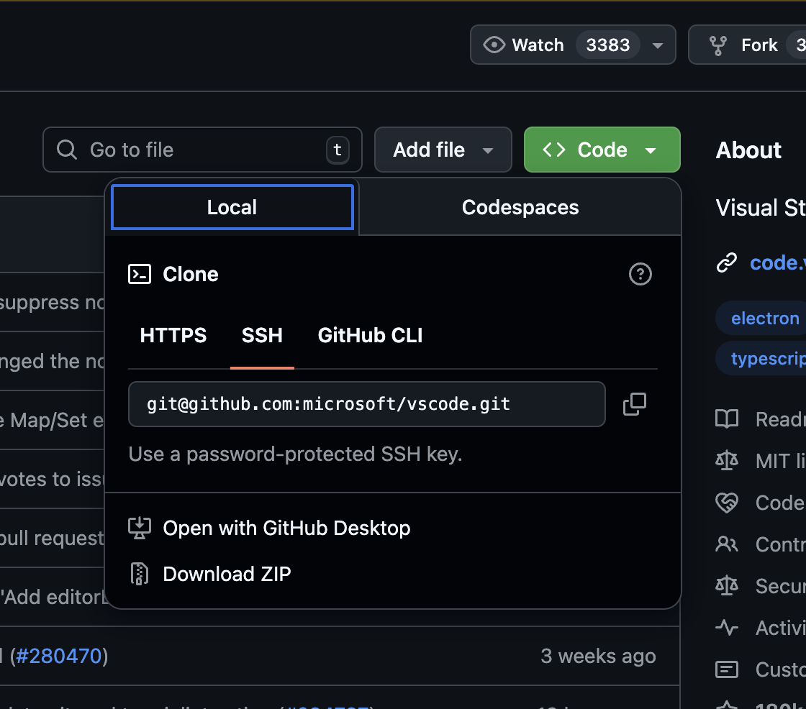

# Travailler en groupe avec Git

Jusqu’à présent, tu as découvert deux intérêts majeurs de Git :

-   📜 conserver l’historique de ton travail grâce aux **commits**
-   ☁️ sauvegarder ton projet en ligne grâce à **`git push`** et **GitHub**

Mais Git révèle toute sa puissance lorsqu’on travaille **à plusieurs sur un même projet**.

Dans ce guide, nous allons voir les notions indispensables pour collaborer efficacement en groupe avec **Git et GitHub**.

👉 Si certaines notions de base ne sont pas claires, n’hésite pas à relire le guide
[Les bases de Git](./les-bases-de-git.md).

## Cloner un dépôt existant

Lorsque tu veux récupérer un projet Git déjà créé, tu dois utiliser la commande **`git clone`**.

1. Va sur la page GitHub du dépôt
2. Clique sur **Code** et copie l’URL **SSH** :



3. Dans ton terminal, exécute la commande suivante (exemple) :

```bash
git clone git@github.com:microsoft/vscode.git
```

> ⚠️ **Attention**
> Assure-toi bien d’utiliser l’URL **SSH**.
> Si tu utilises une URL en `https`, Git ne pourra pas utiliser ta clé SSH configurée dans le premier guide.

---

## Récupérer les modifications : `git pull`

La commande **`git pull`** permet de récupérer les changements envoyés sur GitHub par les autres membres du groupe.

Pour l’utiliser, place-toi à la **racine de ton projet**, puis tape :

```bash
git pull
```

---

## Les différents modes de `git pull`

Lors de ton premier `git pull`, Git peut t’afficher un message d’erreur te demandant de choisir **un mode de synchronisation**.

### Exemple de message d’erreur Git (par défaut)

```text
hint: You have divergent branches and need to specify how to reconcile them.
hint: You can do so by running one of the following commands sometime before
hint: your next pull:
hint:
hint:   git config pull.rebase false  # merge
hint:   git config pull.rebase true   # rebase
hint:   git config pull.ff only       # fast-forward
fatal: Need to specify how to reconcile divergent branches.
```

Ce message signifie que Git ne sait pas **comment fusionner ton travail avec celui des autres**.

### Les modes possibles

-   ❌ **fast-forward**

    -   Mode par défaut
    -   Fonctionne uniquement s’il n’y a **aucun conflit**
    -   ❗ Ne gère pas les modifications concurrentes

-   ❌ **rebase**

    -   Donne un historique Git plus propre
    -   Plus complexe à comprendre et à utiliser
    -   🔴 Déconseillé pour les débutants

-   ✅ **merge (recommandé)**

    -   Le plus simple pour débuter
    -   Gère les conflits dans **un commit de fusion**
    -   Idéal pour le travail en groupe

### Configurer Git pour utiliser `merge` par défaut

Pour éviter ce message à chaque `git pull`, configure Git une bonne fois pour toutes :

```bash
git config --global pull.rebase false
```

✅ À partir de maintenant, Git utilisera automatiquement le mode **merge** lors des `git pull`.

💡 **Conseil pour le travail en groupe**
Fais régulièrement des `git pull` **avant de commencer à travailler**, cela limite fortement les conflits.

## Les conflits Git

Lorsque tout se passe bien, la commande **`git pull`** permet de **fusionner automatiquement** :

-   les commits déjà présents sur GitHub
-   avec les commits que tu as en local sur ton ordinateur

Dans ce cas, aucune action particulière n’est nécessaire.

### Quand apparaît un conflit ?

Un **conflit Git** apparaît lorsque **plusieurs personnes modifient la même partie d’un fichier** et que Git ne sait pas quelle version choisir.

Dans ce cas :

-   Git passe en **mode résolution de conflit**
-   Les fichiers en conflit apparaissent **en rouge dans VS Code**
-   Tu dois **intervenir manuellement** pour décider quoi conserver

### À quoi ressemble un conflit dans un fichier ?

Quand Git ne sait pas quelle version garder, il affiche **les deux versions du code** directement dans le fichier, entourées de marqueurs spéciaux :

```text
<<<<<<< HEAD
console.log("Version locale");
=======
console.log("Version distante");
>>>>>>> origin/main
```

-   `<<<<<<< HEAD` : correspond à **ta version locale**
-   `=======` : sépare les deux versions
-   `>>>>>>> origin/main` : correspond à la version venant de **GitHub**

### Résoudre un conflit

Pour résoudre un conflit, tu dois suivre les étapes suivantes :

1. Modifier le fichier

    - Supprime **tous les marqueurs** (`<<<<<<<`, `=======`, `>>>>>>>`)
    - Garde uniquement **le code que tu veux conserver**
    - Tu peux aussi combiner les deux versions si nécessaire

2. Ajouter les fichiers corrigés `git add nom-du-ou-des-fichiers`
3. Créer le commit de fusion `git commit -am "fix all conflicts, youhou! 🎉"`
4. Enfin, n'oublie pas de synchroniser tes commits locaux avec github : `git push`

> ⚠️ **Attention**
> Si tu as des conflits dans **plusieurs fichiers**, assure-toi de :
>
> -   corriger **tous** les fichiers concernés
> -   faire un `git add` pour chacun d’eux
>
> avant de lancer le `git commit` et le `git push`.

💡 **Astuce**
Plus tu fais des `git pull` régulièrement, moins tu auras de conflits difficiles à résoudre.
