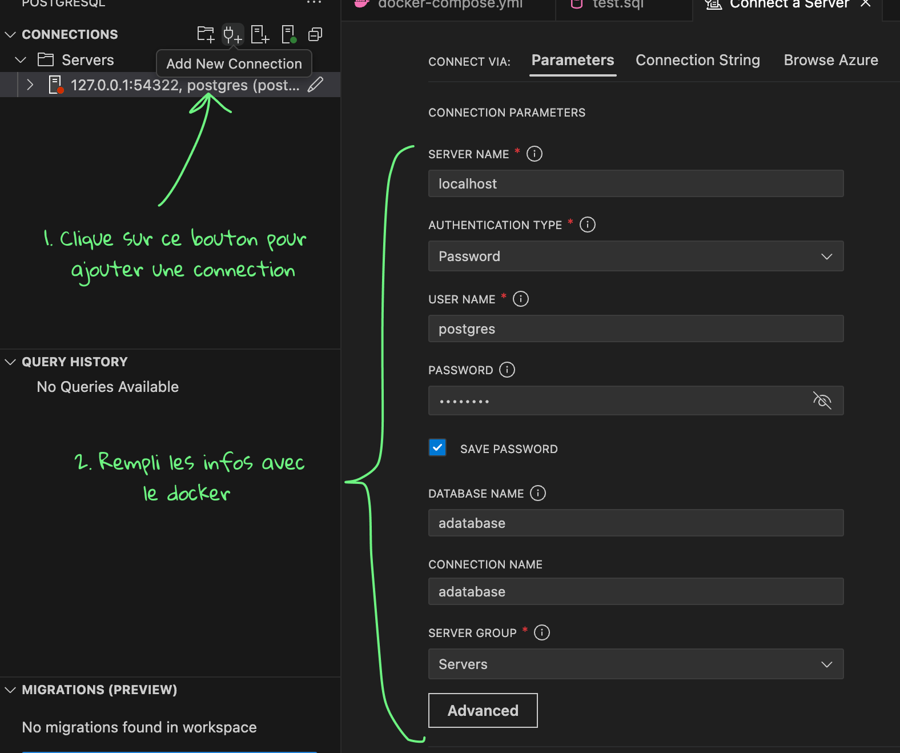

# Installer docker pour postgres

## installer et créer une base de données postgres

Pour pouvoir utiliser postgres en local, on va créer une instance de base de données grâce à docker.

1. Installe docker sur ton ordi : https://www.docker.com/products/docker-desktop/
2. Crée le dossier (et le repo git pour ton projet)
3. Copie le code suivant dans le dossier du projet dans un fichier `docker-compose.yml` :

```yaml
version: "3.8"

services:
  postgres:
    image: postgres:17.5-alpine
    container_name: adatabase_local
    environment:
      POSTGRES_USER: postgres
      POSTGRES_PASSWORD: postgres
      POSTGRES_DB: adatabase
    ports:
      - "5432:5432"
    volumes:
      - postgres_data:/var/lib/postgresql/data

volumes:
  postgres_data:
```

4. Tu peux cliqué directement dans vscode sur **Run services** ou utiliser la commande `docker compose up -d` pour démarrer la base de données
5. Pour tester tes requêtes, tu peux utiliser un outil comme dbeaver ou installer l'extension PostgreSQL dans VSCode :


Une fois l'extension installée, tu peux connecter ta base de données en remplissant les infos à partir du docker :



- Server name : localhost
- User : postgres
- Password : postgres
- Database : adatabase

Ensuite, tu peux simplement exécuter les requêtes en créant un fichier .sql :


