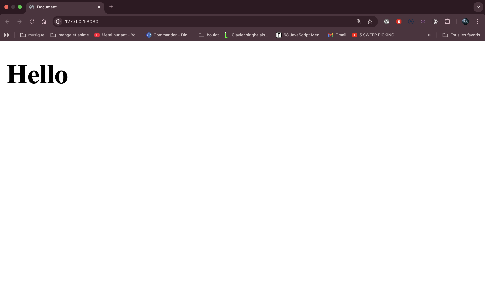

# Partie 1 : Introduction HTML

## LE HTML, KeskeCé ?

Le HTML ou _Hyper Text Markup Language_ est un langague de programmation fonctionnant à base de **balise**, il a été inventé en 1989 par Tim Bernes-Lee, peu après on a mit en place un outil souvent utiliser avec le **HTML**, le **CSS**, celui-ci permis de modifier et personnaliser les sites, ce qui offra un confort visuel.

## Comment ça marche ?

Maintenant que nous savons dans les grandes lignes ce que représente le HTML, nous allons l'utiliser, pour se faire nous vous invitons à aller dans votre dossier `ada` et à créer un dossier `intro_HTML`, dans ce dossier vous aller créer un fichier html en écrivant ceci : `touch index.html`

ce `index.html` sera notre base pour pouvoir explorer plus en profondeur **HTML**

une fois ce fichier créer, ouvrez-le à l'aide de VSCode, ça sera avec cette outil que vous allez manipuler / créer / supprimer des choses avec HTML

dans VSCode vous aller prendre votre fichier `index.html` est rentrer ceci :

```html
<h1>Hello</h1>
```

ce qui nous donnera ceci en utilisant `npx live-server`

<!-- inserer html -->



Ah oui, l'air de rien nous avons rentrer beaucoup d'information, que nous allons decortiquer ensemble !

- le `<` est l'ouverture de la **balise**, elle vous permet de rentrer le type de **balise** que vous voulez utiliser
- le `h1` est tout simplement ... la **balise** ui, il en existe énormément avec chacune leur utilité et intérêt, dans notre cas cette **balise** permet de mettre en **titre** l'élément compris dans notre balise
- le `>` est la fermeture de la balise, c'est en réunissant les trois que votre ordinateur comprend ce qu'on veut afficher
- `Hello` rien de plus que le mot que nous souhaitons afficher, celui-ci était facile à deviner oui
- `</` nous avions ouvert et fermer notre permière balise mais il faut bien donner une limite au mot que l'on va utiliser, cette deuxième ouverture de **balise** nous offre se service
- le deuxième `h1` on précise que l'on veut fermer, dans notre cas nous avons ouvert un **titre** qui contenait `Hello` il faut maintenant le fermer pour pouvoir savoir ce qu'on manipule
- et enfin le `>`, tout simplement la fermeture de la deuxième balise
  Voilà ! vous savez maintenant le mécanisme des balises en détail, ça peut sembler rudimentaire mais c'est comme n'importe quel langue, une fois les notions de base acquise, ces principes vous semlberons plus naturel

(_à partir de cette partie nous vous invitons à faire ou refaire les exercices proposés_)

## Les Commentaires

Maintenant que nous savons manipuler une balise est bon de savoir quand l'utiliser ou non, pour se faire il existe les **commentaires** !
Les commentaires ont pour utilités de rendre votre visible que par vous ... je m'explique, immaginons que nous avons ce site :

```html
<!DOCTYPE html>
<html lang="en">
  <head>
    <meta charset="UTF-8" />
    <meta name="viewport" content="width=device-width, initial-scale=1.0" />
    <title>Document</title>
  </head>
  <body>
    <h1>Mon super siteWeb</h1>
  </body>
</html>
```

bien, pour l'instant nous avons un site tout ce qui a de plus standard, il nous faudrait une description mais nous ne savons pas encore quoi mettre, c'est à ce moment préciser que nous rajoutons les fameux **commentaires**, nous passerons alors de

```html
<!DOCTYPE html>
<html lang="en">
  <head>
    <meta charset="UTF-8" />
    <meta name="viewport" content="width=device-width, initial-scale=1.0" />
    <title>Document</title>
  </head>
  <body>
    <h1>Mon super siteWeb</h1>
  </body>
</html>
```

à

```html
<!DOCTYPE html>
<html lang="en">
  <head>
    <meta charset="UTF-8" />
    <meta name="viewport" content="width=device-width, initial-scale=1.0" />
    <title>Document</title>
  </head>
  <body>
    <h1>Mon super siteWeb</h1>
    <!-- mettre une description ici  -->
  </body>
</html>
```

- `<!--` nous permet de déclarer l'ouverture du commentaire
- `-->` ferme le commentaire
  Pour faire cette action vous pouvez utiliser le raccourcis `command` + `/`

### pourquoi mettre des commentaires ?

Pour vous reperer et savoir ce que vous faites dans cette partie du code, alors oui aujourd'hui vous pourrez vous en souvenir mais dans 5 jours / 5 semaines ou encore 5 mois c'est peut-être moins évident, **pensez à vous en mettre pour vous pour que le vous d'après vous remercie**

# Partie 2 : On va plus loin

(Si vous êtes ici, cela siginifie que vous avez déjà valider les quatres premier exercice, sinon nous vous invitons à les faire)

## Il existe combien de balise ???

Comme vous avez pu le voir ou le comprendre, il n'existe pas que des `h1` ou des `p` pour écrire des sites, nous avons aussi des balises comme `html <input/> </br> <span></span> <div></div> ...`
bref on pourrait les énumairer mais ça ne serait pas très intéressant, voici un site regroupe l'ensemble des balises utiliser en HTML (vous n'êtes pas obliger de la connaitre par coeur, ce lien est fait pour les plus curieu.x.ses d'entre vous):
https://www.codeshttp.com/toutes-les-balises-html-liste-complete-avec-syntaxe.html

De notre côté nous allons nous concentrer sur certaine balise, nous allons faire `<div>`
la balise `<div>` est une balise générique, autrement dit elle n'a aucun paramètre contrairement à `<li>` ou `<ul>` qui va nous permettre de ranger notre code, en effet entre

```html
<h1>Test 1</h1>
<p>text pour mon test 1</p>
<h1>Test 2</h1>
<p>text pour mon test 2</p>
```

et ça :

```html
<div>
  <h1>Test 1</h1>
  <p>text pour mon test 1</p>
  <h1>Test 2</h1>
  <p>text pour mon test 2</p>
</div>
```

la différence ne sera pas flagrante mais ça nous permet de mieux ranger nos balises, ça n'aide pas qu'au rangement, ça permet de gérer l'accessiblité et le SEO (ce qui permet de mettre en avant un site ou non)

Très bonne base 👍
Le fond est juste, mais il y avait :

- des **fautes de langue**
- quelques **imprécisions techniques**
- des phrases à **clarifier pour un·e débutant·e**

Je te propose une **version recorrigée, reformulée et complétée**, avec un **ton pédagogique**, prête à être intégrée dans un cours.

# 📌 Partie 3 : Les liens et les images

Sur la majorité des sites web, on trouve des **images** et des **liens** permettant de naviguer vers d’autres pages ou d’autres sites.
Bonne nouvelle : **HTML permet de faire tout cela très simplement**.

## Afficher une image en HTML

Il existe plusieurs façons d’afficher une image, mais la plus courante utilise la balise ``.

### Exemple :

```html

```

Lorsque ce code est intégré dans une page HTML, le navigateur affiche l’image correspondante.

<!-- insérer une capture d’écran ici -->

### À propos de la balise ``

Contrairement à d’autres balises HTML, **`` est une balise auto-fermante** :

```html

```

Cela signifie qu’elle **n’a pas de balise de fermeture** (`</img>` n’existe pas).

#### Attributs importants :

- `src` : chemin ou URL de l’image
- `alt` : texte alternatif (important pour l’accessibilité et le référencement)

## Rendre une image cliquable (image + lien)

Maintenant que nous savons afficher une image, nous pouvons la rendre **interactive** en la plaçant à l’intérieur d’un lien.

Pour cela, on utilise la balise `<a>`.

### Exemple : image cliquable

```html
<a href="https://fr.wikipedia.org/wiki/Jurassic_Park_(s%C3%A9rie_de_films)">
  
</a>
```

👉 En cliquant sur l’image, l’utilisateur est redirigé vers la page Wikipédia.

### Comprendre la balise `<a>`

- `<a>...</a>` : balise permettant de créer un lien
- `href` : attribut qui définit **la destination du lien**

### Décomposition d’une URL

Prenons cet exemple :

```
https://fr.wikipedia.org/wiki/Jurassic_Park_(s%C3%A9rie_de_films)
```

- `https` : **protocole**, assure une connexion sécurisée
- `fr.wikipedia.org` : **nom de domaine**
- `.org` : **extension** (souvent liée au type d’organisation)
- `/wiki/Jurassic_Park_(s%C3%A9rie_de_films)` : **chemin (path)** vers la ressource

## Liens internes et ancres

Les liens ne servent pas uniquement à naviguer vers d’autres sites.
On peut aussi naviguer **à l’intérieur d’une même page** ou **entre différentes pages d’un site**.

### Lien vers une autre page du site

```html
<a href="contact.html">Page de contact</a>
```

### Lien vers une section de la page (ancre)

```html
<a href="#section-films">Voir les films</a>
```

Et dans la page :

```html
<h2 id="section-films">Les films</h2>
```

# Partie 4 : Le CSS

Après avoir parlé du HTML nous allons aborder le CSS, Le CSS (Cascading Style Sheets) est une feuille de style permettant de personnalisé ton HTML et de le rendre plus agreable et lisible, j'ai pas besoin de préciser que tous les sites utilises d'une manière ou d'une autre le CSS et pour l'utiliser rien de bien compliqué :
voici un code sans CSS :

<!DOCTYPE html>
<html lang="en">
  <head>
    <meta charset="UTF-8" />
    <meta name="viewport" content="width=device-width, initial-scale=1.0" />
    <title>Document</title>
  </head>
  <body>
    <h1>Hello</h1>
  </body>
</html>
