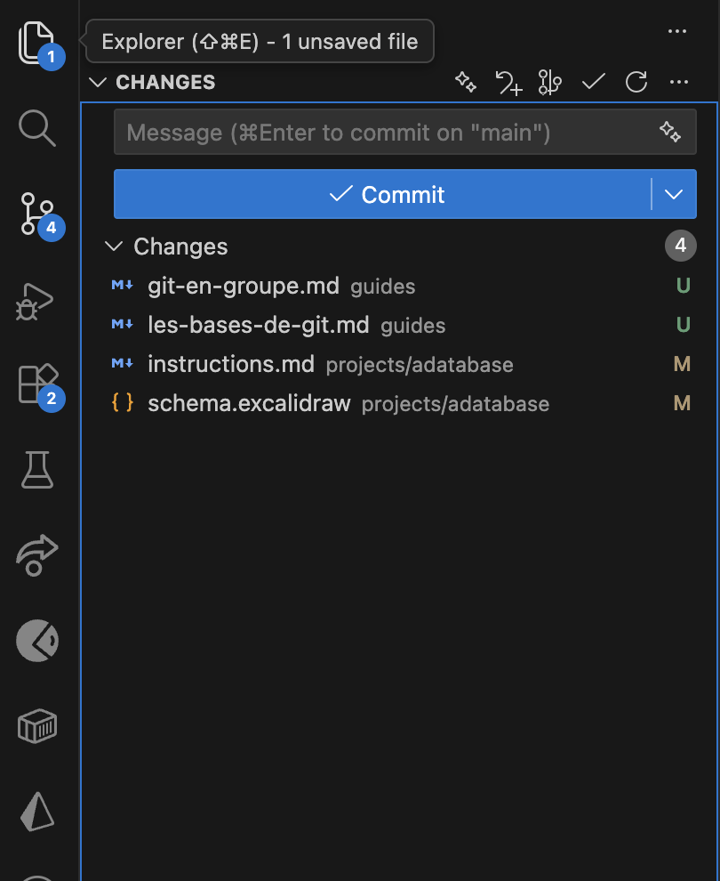
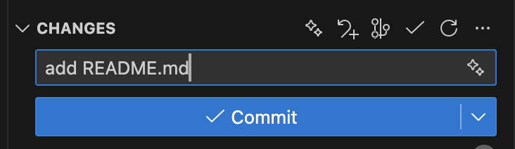

# Les bases de Git

Git est un incoutournable dans la boîte à outil des devs.

Dans ce guide on va t'expliquer comment utiliser Git et Github pour sauvergarder et partager tes projets.

C'est un outil qui peut être frustant et intimidant au début, mais il finira par devenir ton meilleur ami, c'est promis 😉

## Git & Github

**Github** est une platforme qui permet de sauvegarder ses projets Git sur internet, il en existe d'autres comme Gitlab ou Bitbucket par exemple, mais Github est la plus utilisée. Ce type de plateforme permet de partager un projet entre plusieurs personnes.

**Git** est l'outil (utilisé depuis le terminal ou VSCode) qui permet d'intéragir avec ton projet pour créer un historique de sauvegarde et partager le code pour pouvoir travailler à plusieurs sur un même projet.

## Créer ton compte

Tu peux créer (gratuitement) ton compte Github en utilisant ce lien. Ça ne prendra que quelques minutes !

## Installation

Si tu utilises MacOS ou Linux, bonne nouvelle git est probablement déjà installé par défaut sur ton ordinatuer, mais si ce n'est pas le cas, tu peux trouver comment l'installer ici. Ensuite, tu pourras utiliser la commande git depuis VSCode ou avec ton terminal.

Si tu utilises Windows, tu peux le télécharger et l'installer depuis ce lien. Une fois installé, tu pourras lancé le terminal de Git bash directement ou le sélectionner dans VSCode (à la place de powershell).

### Ta clé SSH

La bonne pratique quand on utilise git, c'est de s'identifier en utilisant une clé SSH. En gros, cela consiste à créer des fichiers sur ton ordinateur et sur Github qui permettent de gérer l'identification lorsque tu synchronises tes projets.

Pour la créer et la configurer, tu peux suivre [ce tutoriel](https://docs.github.com/en/authentication/connecting-to-github-with-ssh/generating-a-new-ssh-key-and-adding-it-to-the-ssh-agent) proposé par Github.

## Créer un repository

Un repository est le nom qu'on donne à un projet sur Github. Si tu crées un repository avec le nom que tu as utilisé pour ton compte Github et que tu crées un fichier README.md à l'interieur, il apparaitra directement sur ton profil.

Il est possible de créer un repository depuis l'interface de Github mais il existe une façon beaucoup plus efficace en utilisant directement VSCode :

1. créer le dossier de ton projet, par exemple `monpseudo`
2. ouvre le dans VSCode (`code monpseudo`)
3. ajoute un fichier README.md

Une fois le dossier et les fichiers de base de ton projet créés, tu peux utiliser `ctrl+⇧+P `ou `⌘+⇧+P` sur mac pour ouvrir la palette de commandes puis taper "Publish to Github". Ensuite, suis simplement les instructions et ton projet sera publié sur Github en quelques clics !

## Status & diff

À chaque fois qu'un fichier est modifié, créé ou supprimé, `git` est capable de tracker les changements. Pour les visualiser tu peux utiliser les commandes `git status` et `git diff` ou simplement aller dans l'onglet Source control de VSCode :



## Add/Reset

Tu peux utiliser les commandes `git add` et `git reset` pour ajouter et enlever des changements. Tu peux sinon cliquer sur + ou - dans Source control.

> Ajoute le fichier README.md avec la commande `git add`

## Commit

Une fois les changements ajoutés la commande `git commit` permet de sauvegarder les changements ajoutés en les associant à un message.

```
git commit -am "add README.md"
```



## Push

Enfin pour synchroniser les commits sur Github, tu peux utiliser la commande `git push`.

## Github classroom

Pour tes projets ada, tu devras utiliser github classroom pour créer le repository du projet et le partager avec ton groupe.

TODO: explain process
