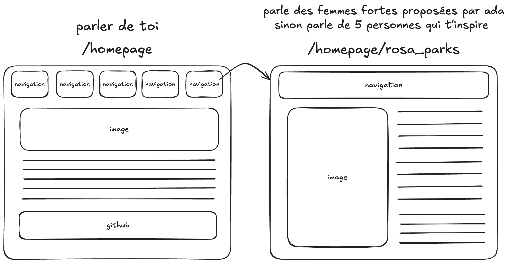

# ✅ Adapage

- **Durée :** 1 semaine
- **Type de projet :** seul / pair programming
- **Nom du repo :** `[nom_promo]-Adapi-[nom_github]`

## 📦 Modalités de rendu

Vous pouvez développer en local sur votre ordinateur, mais pensez à push régulièrement sur la branche `main` du repository git.

> ⚠️ **Important :** Vous devez avoir _poussé_ (`git push`) votre **dernier commit à la date de rendu à minuit au plus tard**, afin qu’il soit pris en compte pour l’évaluation.

## 🎯 Objectif du projet

Nous allons développer un site web fait en html / css parlant de 5 personnes qui vous inspirent, si vous ne voulez pas présenter ces 5 personnes et vous préférez vous concentrer sur le sujet vous pouvez récuperer les personnalitées proposées : \
1 - Rosa Parks \
2 - Jeanne d'Arc \
3 - Marie Curie \
4 - Simone Veil \
5 - Beyoncé

Votre page devra contenir :

- Une section de présentation (votre photo et une description de vous)
- Un menu de navigation
- Une section par personnalité / femme forte (avec une image et une description)

## ⚙️ Initialisation du projet

aussi simple que pour les autres projets, créez un dossier project-[nom_github], initialisez un git, créez un index.html et un style.css, et commencez à coder !

## 🧰 Pré-requis techniques

Pour mener à bien ce projet, il est nécessaire de maîtriser :

- les bases du **terminal**
- les bases de **HTML & CSS**

## 🧩 Fonctionnalités à développer

> ⚠️ **Réalisez toutes les fonctionnalités obligatoires avant de passer aux bonus.**

# 1.Homepage

- [ ] Créer une page HTML avec une structure de base (doctype, head, body)
- [ ] Ajouter une image de vous-même
- [ ] Ajouter une description de vous-même

# 2.Navigation

- [ ] Ajouter une barre de navigation avec des liens vers les sections des personnalités / femmes fortes
- [ ] Styliser la barre de navigation avec CSS
- [ ] Rendre la barre de navigation responsive pour les mobiles
- [ ] Pouvoir naviguer entre chaque section en cliquant sur les liens de la barre de navigation

# 3.Personnalités / femmes fortes

- [ ] Ajouter des sections pour chaque personnalité / femme forte avec une image et une description
- [ ] Styliser la page avec CSS pour améliorer l'apparence
- [ ] Rendre la page responsive pour les mobiles

Pour vous aider, voici un wireframe que vous pouvez suivre :

## 🚫 Ce que vous ne devez pas faire

utiliser des frameworks CSS comme **Bootstrap ou Tailwind CSS** \
utiliser du **JavaScript** pour ce projet

## 💎 Bonus possibles

- [ ] Ajouter des animations CSS pour les images et les descriptions
- [ ] Ajouter un footer avec des liens vers vos réseaux sociaux
- [ ] Utiliser des polices personnalisées avec Google Fonts
- [ ] Ajouter un mode sombre / clair avec CSS
- [ ] Intégrer une vidéo youtube ou alors une carte google maps

## 📦 Modalité d'évaluation

L’évaluation se déroulera sous forme de démonstration. L'apprenante devra présenter une partie des fonctionnalités sur lesquelles iel a travaillé.

Chaque personne devra être capable :

- d’expliquer clairement son code à l’oral,
- de réaliser une démonstration fonctionnelle,
- de naviguer aisément dans son code durant la présentation.

Cette première partie durera **environ 5 minutes par personne**.

Ensuite, l'apprenante répondra à **une à deux questions techniques**, afin de vérifier ses compétences (basées sur le référentiel _Compétences à acquérir_ ci-dessous).
Cette phase durera **environ 2 minutes par personne**.

## 🎓 Compétences à acquérir

- [ ] Je sais créer une structure HTML de base
- [ ] Je sais ajouter des images et du texte dans une page HTML
- [ ] Je sais styliser une page web avec CSS
- [ ] Je sais rendre une page web responsive pour différents appareils
- [ ] Je sais definir et appliquer des styles CSS aux éléments HTML
- [ ] Je sais adapter mes balises à une taille d'écran différente
- [ ] Je sais utiliser la majorité des balises HTML de base (`
`, `<section>`, ``, `
`, `<h1>` à `<h6>`, etc.)
- [ ] Je sais gérer les marges, paddings et alignements avec CSS
- [ ] Je sais gérer ma barre de navigation et le footer de ma page

## 🎓 Soutenance

La soutenance du projet aura lieu le [date et heure à préciser].
