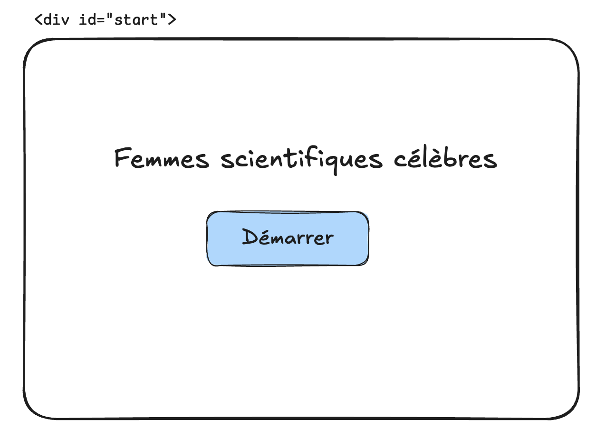
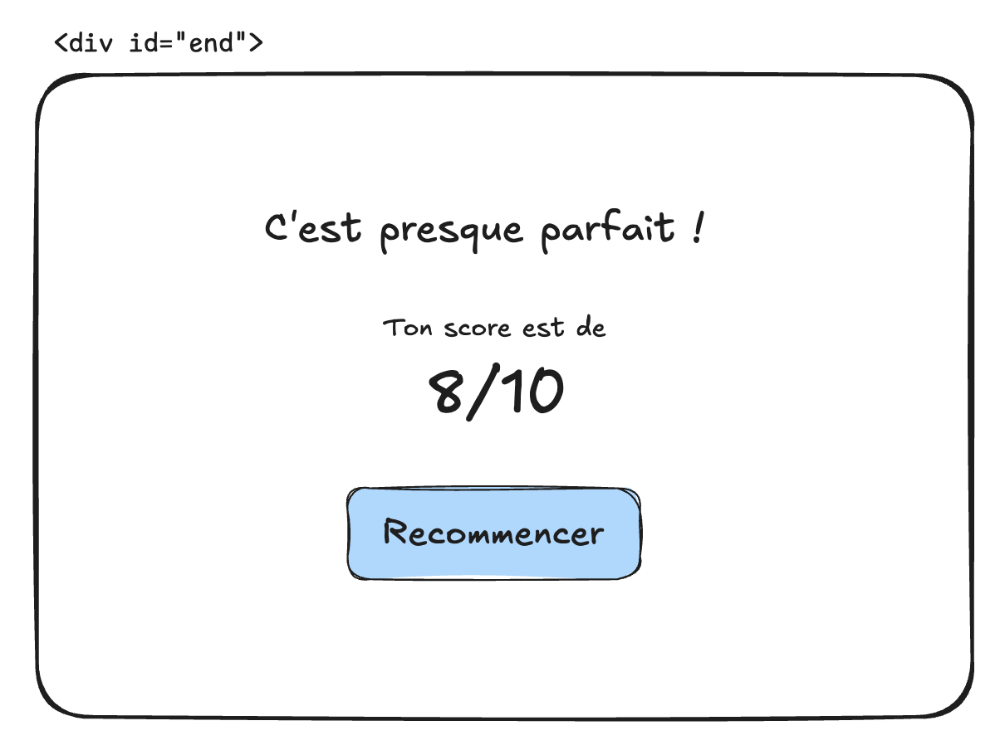

# 🤓 AdaQuiz

-   **Durée :** 1 semaine
-   **Type de projet :** groupe de 3 ou 4
-   **Nom du repo :** `[nom_promo]-projet-[nom_github]`

## 📦 Modalités de rendu

TODO: préciser en fonction de l'avancement sur git

> ⚠️ **Important :** Vous devez avoir _poussé_ (`git push`) votre **dernier commit à la date de rendu à minuit au plus tard**, afin qu’il soit pris en compte pour l’évaluation.

## 🎯 Objectif du projet

Ce projet va te permettre de mettre en pratique ce que tu as appris sur la manipulation du DOM.

Pour cela, tu vas devoir créer une page web avec un quiz interactif. Les questions du quiz seront chargées à partir d’un fichier JSON. L'utilisateur⋅ice devra répondre aux questions l'une après l'autre, et la page de final affichera le score final obtenu par l'utilisateur⋅ice.

Tu devras également personnaliser le design avec du CSS et, si tu as le temps, faire plein de bonus !

## ⚙️ Initialisation du projet

Pour ce projet, bien que nous n’allions pas encore utiliser de framework (comme React ou Vue), nous allons utiliser l’outil Vite pour créer le site web.

Pour ce faire, va dans ton dossier `~/ada` et crée un nouveau projet avec la commande `pnpm create vite`, en choisissant les options suivantes :

```
◇  Project name:
│  quizada
│
◇  Select a framework:
│  Vanilla
│
◇  Select a variant:
│  JavaScript
│
◇  Use rolldown-vite (Experimental)?:
│  No
│
◆  Install with pnpm and start now?
│  ○ Yes / ● No
└
```

Ensuite, tu peux ouvrir le projet dans VS Code avec `code quizada`, puis utiliser la commande `pnpm install` **dans le dossier du projet** pour initialiser les dépendances.

Enfin, tu pourras utiliser `pnpm dev` **dans le dossier du projet** pour démarrer le serveur du site web, puis cliquer sur le lien affiché dans le terminal pour l’ouvrir dans Chrome.

> 💡 Tu peux utiliser `Ctrl + C` dans ton terminal pour arrêter le serveur.

Jusqu’à maintenant, tu créais chaque fichier de ton projet manuellement. Avec Vite, certains fichiers sont créés automatiquement :

```
.
├── index.html # page web html
├── node_modules # contient les bibliothèque installées avec pnpm
│   └── vite -> .pnpm/vite@7.3.0/node_modules/vite
├── package.json # configuration du projet (scripts, dépendances, etc.)
├── pnpm-lock.yaml # tracking des dépendances
├── public # contient les assets comme les images ou les sons
│   └── vite.svg # tu peux le supprimer
└── src # contient le code (c'est à dire les fichiers css et js)
    ├── counter.js # fichier d'exemple pour créer la logique du compteur (tu peux le supprimer)
    ├── javascript.svg # logo JS affiché sur la page (tu peux le supprimer)
    ├── main.js # fichier js principal
    └── style.css # contient le css du projet
```

Tu peux supprimer les fichiers `counter.js`, `javascript.svg` et `vite.svg`.

Tu peux ajouter un fichier `quiz-femmes-scientifiques.json` dans `src` comme ci-dessous :

```json
{
    "title": "Femmes scientifiques célèbres",
    "questions": [
        {
            "question": "Qui est considérée comme la première programmeuse de l’histoire ?",
            "options": ["Grace Hopper", "Ada Lovelace", "Dorothy Vaughan", "Margaret Hamilton"],
            "correctIndex": 1
        },
        {
            "question": "Dans quel domaine Fatomata Kebe est-elle principalement connue ?",
            "options": ["La chimie", "La médecine", "L’astronomie", "La biologie"],
            "correctIndex": 2
        },
        {
            "question": "Quel langage de programmation est associé au travail de Grace Hopper ?",
            "options": ["COBOL", "Java", "Python", "C"],
            "correctIndex": 0
        },
        {
            "question": "Dorothy Vaughan a travaillé pour quelle organisation américaine ?",
            "options": ["IBM", "La NASA", "Le MIT", "L’ESA"],
            "correctIndex": 1
        },
        {
            "question": "Quelle scientifique est la seule femme à avoir reçu deux prix Nobel dans deux disciplines différentes ?",
            "options": ["Rosalind Franklin", "Chien-Shiung Wu", "Marie Curie", "Irène Joliot-Curie"],
            "correctIndex": 2
        },
        {
            "question": "Quelle mathématicienne a joué un rôle clé dans les calculs des missions spatiales Apollo ?",
            "options": ["Dorothy Vaughan", "Ada Lovelace", "Katherine Johnson", "Grace Hopper"],
            "correctIndex": 2
        },
        {
            "question": "Quelle scientifique a contribué à la découverte de la structure de l’ADN grâce à la cristallographie ?",
            "options": ["Rosalind Franklin", "Marie Curie", "Jane Goodall", "Barbara McClintock"],
            "correctIndex": 0
        },
        {
            "question": "Quelle ingénieure a dirigé le développement du logiciel du programme Apollo 11 ?",
            "options": ["Grace Hopper", "Margaret Hamilton", "Katherine Johnson", "Dorothy Vaughan"],
            "correctIndex": 1
        },
        {
            "question": "Chien-Shiung Wu est connue pour ses contributions majeures dans quel domaine ?",
            "options": ["La chimie organique", "L’astronomie", "La physique nucléaire", "L’informatique"],
            "correctIndex": 2
        },
        {
            "question": "Quelle scientifique est connue pour ses travaux sur le comportement des chimpanzés ?",
            "options": ["Jane Goodall", "Marie Curie", "Rosalind Franklin", "Fatomata Kebe"],
            "correctIndex": 0
        }
    ]
}
```

> 💡 Pour l'instant, fais déjà fonctionner le projet avec ces questions mais tu pourras personnaliser ton quiz lorsque ça fonctionnera.

Enfin, tu peux remplacer le code de `main.js` comme ci-dessous :

```js
import "./style.css";
import quiz from "./quiz-femmes-scientifiques.json";

document.querySelector("#app > h1").innerText = quiz.title;
```

> ⚠️ Attention, pour que ça fonctionne il faut que tu ajoutes un `h1` dans `#app` dans `index.html`

Si tu as tout bien fait, tu devrais avoir `"Femmes scientifiques célèbres"` qui s'affiche dans ton navigateur.

> 💡 Pour la suite du projet, tu peux utiliser les fichiers `main.js`, `style.css` et `index.html` mais n'hésite pas à créer d'autres fichiers js et css pour mieux ranger ton code !

## 🧰 Pré-requis techniques

Pour mener à bien ce projet, il est nécessaire de maîtriser :

-   les bases du **terminal**
-   les bases du **JavaScript**
-   les bases du **DOM**

## 🧩 Fonctionnalités à développer

> ⚠️ **Réalise toutes les fonctionnalités obligatoires avant de passer aux bonus.**

### 1. L'écran d'accueil



-   [ ] L’écran d’accueil doit contenir **au minimum** le titre du quiz (récupéré depuis le JSON) et un bouton **Démarrer** (ne complexifie pas trop cet écran tant que ton quiz n’est pas fonctionnel).
-   [ ] Lorsqu’on clique sur **Démarrer**, cet écran doit être caché afin d’afficher l’écran représentant la question en cours.

### 2. L'écran question


-   [ ] Le HTML de cet écran doit contenir :

    -   un header rappelant le titre du quiz (`title` dans le JSON) ;
    -   une div contenant la question courante ;
    -   une div avec **4 boutons** correspondant aux **4 réponses possibles** ;
    -   une div permettant d’afficher un message (_Bonne réponse_ ou _Mauvaise réponse, la bonne réponse est ..._ en fonction du choix de l’utilisateur·ice) ;
    -   un bouton permettant de passer à la question suivante.

-   [ ] Faire en sorte que la question et les réponses soient chargées directement depuis le JSON (la première question du tableau).
-   [ ] Lorsqu’on clique sur l’un des boutons de réponse :

    -   si l’indice du bouton correspond à l’indice de la bonne réponse (`correctIndex`), afficher **« Bonne réponse »** dans la div message ;
    -   sinon, afficher :
        `Mauvaise réponse, la bonne réponse est ${question.options[question.correctIndex]}`.

-   [ ] Le bouton **« Question suivante »** doit être caché par défaut et s’afficher lorsqu’on clique sur une réponse.

    -   Lorsqu’on clique sur ce bouton, il doit afficher la question suivante. Si l’on est à la dernière question, il doit afficher l’écran de fin.

### 3. L'écran de fin



-   [ ] Le HTML de cet écran doit contenir :

    -   un titre affichant un message en fonction du score ;
    -   un sous-titre **« Ton score est de »** ;
    -   une div affichant le score sur le nombre total de questions ;
    -   un bouton permettant de **recommencer** le quiz.

-   [ ] Le score doit être calculé automatiquement en fonction du nombre de bonnes réponses. On affiche donc :
        `bonnes réponses / nombre de questions`.
-   [ ] Le titre doit changer en fonction du score :

    -   si **0 %** : `"Oups ! Tu n'as trouvé aucune bonne réponse 😱"` ;
    -   si **moins de 50 %** : `"Aïe, tu as beaucoup d'erreurs, tu devrais réessayer 😅"` ;
    -   si **plus de 50 % et moins de 80 %** : `"C'est pas mal, mais tu peux encore t'améliorer 💪"` ;
    -   si **plus de 80 % et moins de 100 %** : `"C'est bien, tu as fait peu d'erreurs 😉"` ;
    -   si **100 %** : `"Aucune erreur, c'est parfait 😎"`.

-   [ ] Le bouton **« Recommencer »** doit réinitialiser le score et relancer le quiz à la première question.

## 🚫 Ce que vous ne devez pas faire

-   **Utiliser du code que tu ne comprends pas ou que tu ne sais pas expliquer**
-   Utiliser un framework comme React ou Vuejs
-   Utiliser TypeScript
-   Utiliser une base données
-   Développer un backend
-   Utiliser une API

## 💎 Bonus possibles

Tu peux proposer tes propres améliorations une fois que tu as fini la partie obligatoire, mais voici une liste de suggestions de bonus que tu peux implémenter :

-   [ ] Faire un design **super stylé**.
-   [ ] Ajouter des animations (par exemple pour faire apparaître les réponses une par une ou lors de la validation).
-   [ ] Ajouter une barre de progression au-dessus du quiz.
-   [ ] Ajouter des confettis lorsqu’on trouve la bonne réponse (`pnpm install canvas-confetti`).
-   [ ] Ajouter des sons lorsqu’on choisit une réponse ou à la fin du quiz.
-   [ ] Ajouter un système de vies (par exemple, au bout de **3 erreurs**, on doit recommencer).
-   [ ] Gérer plusieurs quiz avec une page d’accueil permettant de choisir entre les différents quiz.
-   [ ] Ajouter des images spécifiques par question ou des icônes pour les réponses.
-   [ ] Mélanger l'ordre des réponses et des questions pour qu'elles ne s'affichent pas dans le même ordre à chaque essai
-   [ ] Ajouter un **dark mode** au site.
-   [ ] Sauvegarder le score précédent dans le `localStorage`.
-   [ ] Ajouter un compte à rebours pour répondre à une question (si le temps est dépassé, la réponse est automatiquement considérée comme fausse).

### 🚀 Super bonus

-   [ ] Gérer les questions avec plusieurs bonnes réponses
-   [ ] Faire un système de leaderboard
    -   L'utilisateur⋅ice peut entrer son nom pour sauvegarder son score dans le localStorage
    -   Les 10 meilleurs scores sont affichés avec le nom du/de la joueur⋅se depuis le localStorage
-   [ ] Gérer la traduction des quiz et de l'interface
-   [ ] Gérer le markdown dans les questions et les réponses

## 📦 Modalités d'évaluation

TODO: soutenance + demo ?

## 🎓 Compétences à acquérir

-   [ ] Je sais initialiser un projet avec **Vite**.
-   [ ] Je sais travailler en groupe avec **Git**.
-   [ ] Je sais créer une page HTML à partir d’un wireframe.
-   [ ] Je sais utiliser **CSS** pour positionner des éléments (Flexbox, Grid).
-   [ ] Je sais utiliser **CSS** pour modifier le design de ma page.
-   [ ] Je sais récupérer des éléments du **DOM** en JavaScript.
-   [ ] Je sais utiliser les **événements** JavaScript.
-   [ ] Je sais utiliser les boucles et les conditions.
-   [ ] Je sais coder une logique à partir d’un énoncé.

## 🎓 Soutenance

TODO: préciser la date et l'heure de la soutenance du projet
