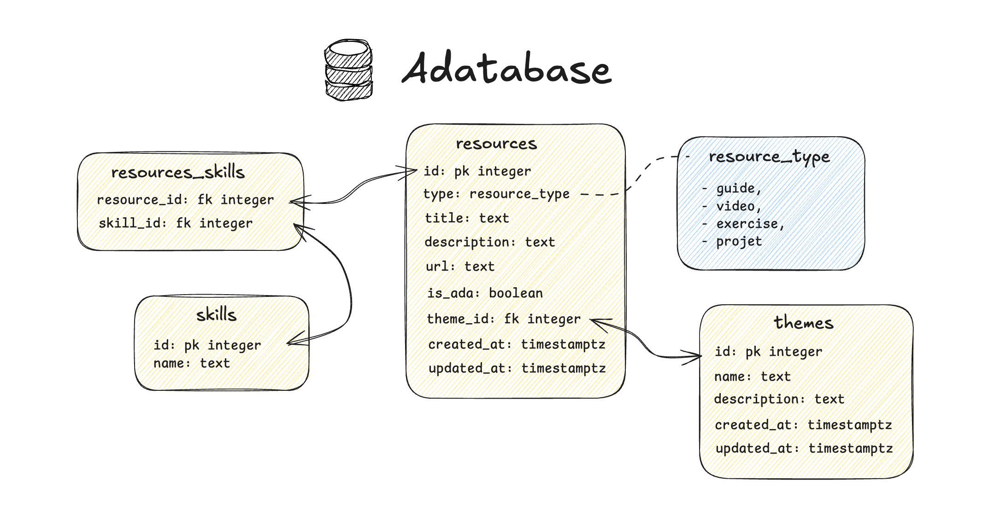

# 🗃️ Adatabase

-   **Durée :** 1 semaine
-   **Type de projet :** seul / pair programming
-   **Nom du repo :** `adatabase-[nom_github]`

## 📦 Modalités de rendu

Vous pouvez tester vos scripts SQL directement sur des outils (comme Neon, Supabase ou Simple SQLite Editor) mais l'ensemble du code SQL devra être pushé sur la branche `main` du git du projet.

> ⚠️ **Important :** Vous devez avoir _poussé_ (`git push`) votre **dernier commit la veille de la soutenance à minuit au plus tard**, afin qu'il soit pris en compte pour l'évaluation.

Les fichiers à rendre sont les suivants :

-   `migration_up.sql` contient l'ensemble du SQL pour créer les tables et enums de la base
-   `migration_down.sql` contient le SQL qui permet de supprimer toutes les tables (l'inverse de migration_up)
-   `seed.sql` remplit les tables de la base de données avec des données
-   `queries.sql` contient les requêtes SELECT pour récupérer certaines données de la base

## 🎯 Objectif du projet

Tu devras créer une petite base de données de gestion de ressources pédagogiques. Tu devras créer 4 scripts SQL : un pour créer la base de données, un pour la nettoyer, un troisième pour remplir les données et enfin un dernier avec des requêtes SELECT pour récupérer des données en fonction de certains filtres.

## ⚙️ Initialisation du projet

Tu peux créer un projet sur [Neon](https://neon.com/) ou directement utiliser [Simple SQLite Editor](https://simple-sqlite-editor.vercel.app/) pour faire tes tests.

## 🎓 Compétences à acquérir

-   [ ] Je sais créer des tables SQL avec des contraintes
-   [ ] Je sais utiliser des clés étrangères et des relations entre tables
-   [ ] Je sais insérer des données dans une base de données
-   [ ] Je sais écrire des requêtes SELECT avec différents filtres
-   [ ] Je sais utiliser les jointures SQL

## 🧩 Fonctionnalités à développer

> ⚠️ **Réalisez toutes les fonctionnalités obligatoires avant de passer aux bonus.**

-   [ ] Crée les tables comme sur le schéma ci-dessous :

-   **themes** permet de grouper l'ensemble des ressources sur un thème précis (comme 'Frontend' ou 'Base de données' par exemple)
-   **resources** contient toutes les informations sur une ressource, notamment son titre et le lien vers la ressource (url)
-   **skills** représente une compétence en particulier qui est abordée par la ressource. Contrairement au thème, une ressource peut concerner plusieurs compétences
-   **resources_skills** permet de faire le lien entre une ressource et une compétence
-   **resource_type** enum permettant de limiter le type de ressources possible à une liste prédéterminée : `article`, `video`, `exercice`, `documentation` (⚠️ n'existe qu'avec Postgres)

> 💾 Une fois que toutes tes requêtes fonctionnent, sauvegarde-les dans un fichier `migration_up.sql`.

-   [ ] Écris un script pour nettoyer la base de données. L'idée c'est de faire l'inverse de `migration_up.sql`, écris le SQL pour supprimer toutes les tables de la base de données.

> 💾 Une fois que toutes tes requêtes fonctionnent, sauvegarde-les dans un fichier `migration_down.sql`.

-   [ ] Dans cette étape, le but est de remplir la base de données. Pour ce faire, écris le code SQL pour insérer des lignes dans chacune des tables. Fais bien attention à avoir des données dans chaque table.

Voici des exemples de données à insérer (tu peux en ajouter d'autres) :

**Table themes :**

| id  | name            |
| --- | --------------- |
| 1   | Frontend        |
| 2   | Backend         |
| 3   | Base de données |
| 4   | DevOps          |

**Table resources :**

| id  | title                 | url                      | description          | type     | is_ada | theme_id |
| --- | --------------------- | ------------------------ | -------------------- | -------- | ------ | -------- |
| 1   | Introduction à React  | https://react.dev        | Guide officiel React | guide    | false  | 1        |
| 2   | SQL pour débutants    | https://example.com/sql  | Cours SQL complet    | video    | false  | 3        |
| 3   | Exercices JavaScript  | https://example.com/js   | Pratique JS          | exercice | false  | 1        |
| 4   | Créer une API en node | https://example.com/node | Projet node          | projet   | false  | 2        |

**Table skills :**

| id  | name       |
| --- | ---------- |
| 1   | JavaScript |
| 2   | React      |
| 3   | SQL        |
| 4   | PostgreSQL |
| 5   | Node.js    |

**Table resources_skills (exemples de liaisons) :**

| resource_id | skill_id |
| ----------- | -------- |
| 1           | 1        |
| 1           | 2        |
| 2           | 3        |
| 2           | 4        |
| 3           | 1        |
| 4           | 1        |
| 4           | 5        |

> 💾 Une fois que toutes tes requêtes fonctionnent, sauvegarde-les dans un fichier `seed.sql`.

-   [ ] Dernière étape, récupérer les données. Écris les requêtes SQL de sélection suivantes :
    -   [ ] Récupérer la liste des thèmes
    -   [ ] Récupérer toutes les ressources triées par date de mise à jour
    -   [ ] Récupérer uniquement le nom et l'url des ressources de type exercice
    -   [ ] Récupérer le titre et la description des ressources d'Ada uniquement
    -   [ ] Récupérer les ressources qui ont la compétence JavaScript associée
    -   [ ] Récupérer les ressources dont le titre contient le mot "react" (avec ou sans majuscules)

> 💾 Sauvegarde toutes ces requêtes dans un fichier `queries.sql`.

## 💎 Bonus possibles

-   [ ] Récupérer la liste des thèmes avec le nombre de ressources par thème
-   [ ] Récupérer le nom et l'url de toutes les ressources avec un tableau/liste contenant l'ensemble de leurs skills associés
-   [ ] Récupérer les 5 ressources les plus récentes avec leur thème
-   [ ] Récupérer toutes les compétences qui ne sont associées à aucune ressource
