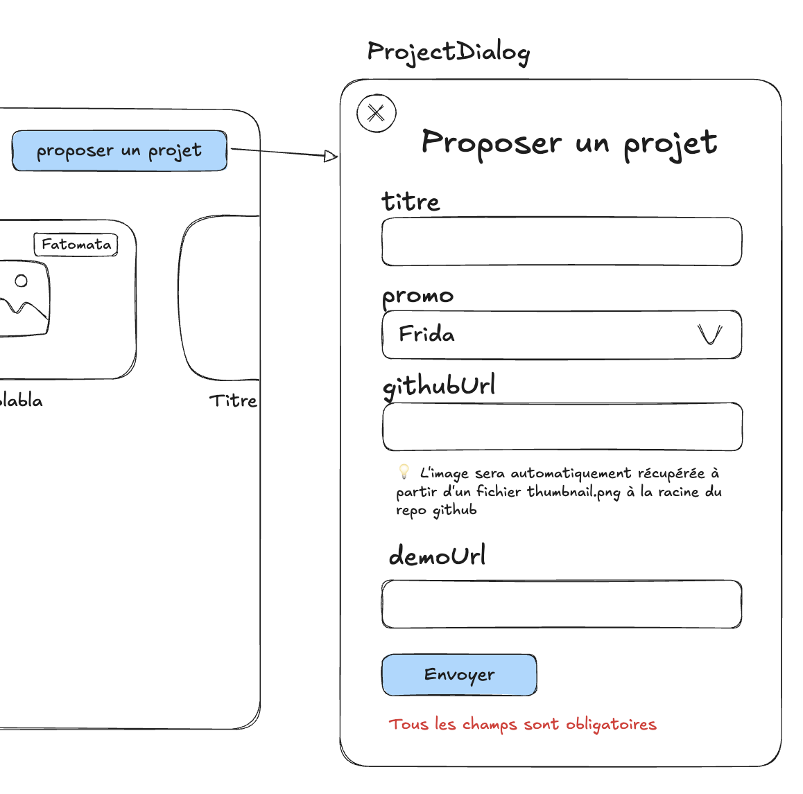
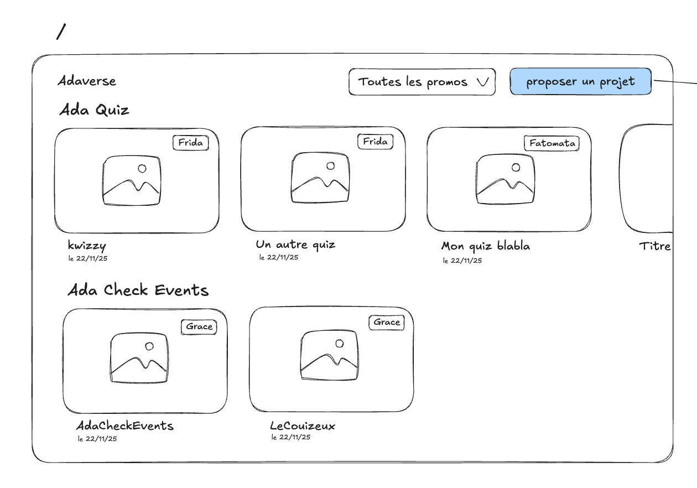
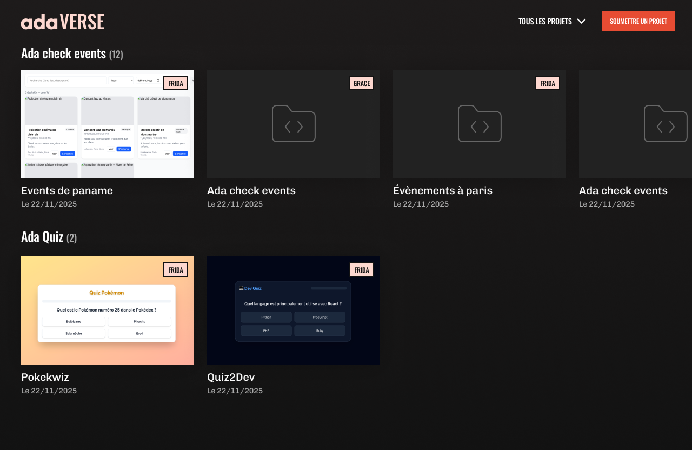
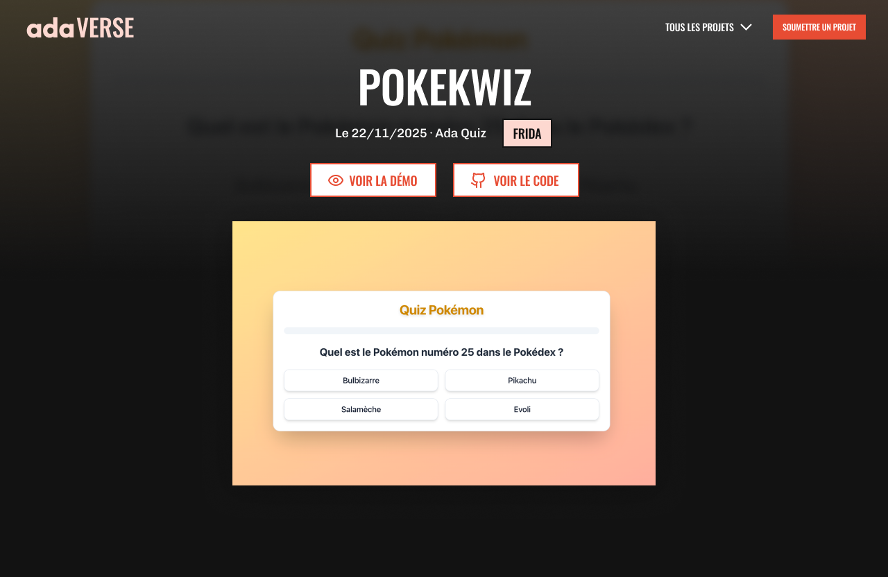

# 🌐 Adaverse

-   **Durée :** 2 semaine
-   **Type de projet :** seul / pair programming
-   **Nom du repo :** `adaverse-[nom_github]`

## 📦 Modalités de rendu

Vous pouvez développer sur la branche `main`, mais le projet devra être livré sur **deux branches distinctes** :

-   `stable` → version **complète avec toutes les fonctionnalités obligatoires**, **sans bonus**.
-   `bonus` → version enrichie avec les **fonctionnalités bonus**.

> ⚠️ **Important :** Vous devez avoir _poussé_ (`git push`) votre **dernier commit la veille de la soutenance à minuit au plus tard**, afin qu’il soit pris en compte pour l’évaluation.

## 🎯 Objectif du projet

Ce projet consiste à développer une **plateforme de visualisation de projets réalisés par les apprenant·e·s d’Ada**.
Chaque projet sera classé par **catégorie**, correspondant à un **projet du programme Ada** (ex. : _Ada Quiz_, _Adaopte_, _Ada Check Events_, etc.).

L’application sera **fullstack**, réalisée avec **Next.js**, **TailwindCSS** et **TypeScript**, et connectée à une base de données hébergée sur **Neon**, via l’ORM **Drizzle**.

Les utilisateur·rice·s pourront **proposer un projet** via la page d’accueil, mais **seul·e le·la développeur·euse** de la plateforme pourra **valider et publier** les projets pour qu’ils apparaissent sur le site.

## 🧱 Stack technique (obligatoire)

| Élément             | Technologie | Lien                            |
| ------------------- | ----------- | ------------------------------- |
| Framework fullstack | Next.js     | https://nextjs.org/             |
| Framework CSS       | TailwindCSS | https://tailwindcss.com/        |
| ORM                 | Drizzle ORM | https://orm.drizzle.team/       |
| Base de données     | Neon        | https://neon.com/               |
| Langage             | TypeScript  | https://www.typescriptlang.org/ |

## ⚙️ Initialisation du projet

Installe l'ensemble des dépendances en suivant les documentations officielles.

Pour Next.js tu peux regarder cette section : https://nextjs.org/docs/app/getting-started/installation.

> ⚠️ N'oublie pas de choisir tailwind et TypeScript pendant la configuration

Pour Neon, crée un projet, récupère la "connection string" de la base de données et copie la dans ton `.env`.

Enfin, pour Drizzle, tu peux suivre la documentation officielle pour Neon à [ce lien](https://orm.drizzle.team/docs/connect-neon) ou notre petit guide d'installation [ici](../../guides/installer-drizzle.md). Une fois la connection et le schéma créé, tu es prêt⋅e pour coder !

## 🚀 Déploiement

Tu peux utiliser **[Vercel](https://vercel.com/)** la plateforme officielle pour héberger les applications **Next.js**.

Attention, n'oublie pas de spécifier la variable d'environnement pour te connecter à Neon sur Vercel (la même que dans ton fichier `.env`).

> 💡 Pensez à déployer le plus tôt possible, dès qu’une version basique fonctionnelle existe.

## 🧰 Pré-requis techniques

Pour mener à bien ce projet, il est nécessaire de maîtriser :

-   les bases du **terminal**
-   les bases du **JavaScript**
-   les bases du **React**
-   les bases du **SQL**
-   les bases du **développement backend**

## 🎓 Compétences à acquérir

### Back / BDD

-   [ ] Je sais intégrer et utiliser une ORM avec NextJS
-   [ ] Je sais connecter mon ORM avec ma base de données
-   [ ] Je sais créer une base de donnée à partir d'un schéma
-   [ ] Je sais visualiser et modifier des données dans la base de données
-   [ ] Je comprends le fonctionnement d'un ORM (mapping object relationnel)
-   [ ] Je sais modéliser une base de données à partir d'un énoncé
-   [ ] Je comprends les avantages et les inconvénients que l'ORM apporte
-   [ ] J'arrive à implémenter mon ORM dans mon code
-   [ ] Je sais récupérer des données venant de plusieurs tables avec l'ORM (foreign keys)
-   [ ] Je sais faire un CRUD de ma donnée avec mon ORM
-   [ ] Je sais créer des routes api et des composants serveur dans NextJS
-   [ ] Je sais créer et exécuter des migrations
-   [ ] Je sais créer et manipuler des forms actions

### Front

-   [ ] Je peux créer une page dans NextJS
-   [ ] Je comprends l'utilité du `"use client"`
-   [ ] Je comprends comment et quand utiliser useState et useEffect
-   [ ] Je sais fetch des routes API depuis une page NextJS
-   [ ] Je sais découper le code de mon projet en plusieurs fichiers
-   [ ] Je comprends le système de routes de NextJS
-   [ ] Je sais créer des routes dynamiques avec des paramètres d'URL
-   [ ] Je sais récuperer le paramètre avec `params`
-   [ ] Je sais comment utiliser `Link` pour naviguer entre les pages côté client
-   [ ] Je sais faire la différence entre une route statique et dynamique
-   [ ] Je sais appliquer du style à mes composants avec tailwind
-   [ ] Je sais créer un dialogue

## 🧩 Fonctionnalités à développer

> ⚠️ **Réalisez toutes les fonctionnalités obligatoires avant de passer aux bonus.**

### 1. 🗂️ Conception de la base de données

Cette partie se réalise avec **Drizzle ORM** en créant le schéma de la base de données.

#### Tables à concevoir

-   **Table des projets Ada**

    -   Contient la liste des différents **projets du programme Ada**.
    -   Chaque entrée correspond à un **type de projet officiel** (ex. : Adaopte, Ada Quiz…).
    -   Elle doit inclure un identifiant unique et un **nom de projet** clair et distinct.

-   **Table des promotions Ada**

    -   Contient l’ensemble des **promotions d’apprenant·e·s**.
    -   Chaque promo doit avoir un identifiant unique, un **nom** (ex. "Frida") et une **date de début**.

-   **Table des projets étudiantes / étudiants**
    -   Représente les **projets réalisés par les apprenant·e·s** pour un projet Ada donné.
    -   Chaque projet doit inclure :
        -   un **titre** clair,
        -   une **illustration** pour avoir un visuel du projet
        -   une **adresse web personnalisée** (slug) pour générer une URL propre,
        -   un **lien GitHub**,
        -   un **lien vers la démo** en ligne,
        -   une **date de création** (quand le projet est proposé),
        -   une **date de publication** (vide tant que le projet n’est pas validé),
        -   un **lien vers la promotion**,
        -   un **lien vers le projet Ada** concerné.

### 2. 🌱 Création d’une seed de données

Une **seed** permet d’ajouter des données de base dans la base de données.

#### Tâches à réaliser

-   [ ] Créer un script `.sql` pour insérer les **promotions Ada**
-   [ ] Créer un script `.sql` pour insérer les **projets Ada**
-   [ ] Créer un script `.sql` permettant de **publier un projet** (en mettant à jour sa date de publication selon son identifiant)

### 3. 💻 Intégration sur le site

#### a. Formulaire de proposition de projet

-   [ ] Ajouter sur la page d’accueil `/` un **bouton "Proposer un projet"** dans le header.
-   [ ] Le **bouton "Proposer un projet"** ouvre une **popup** contenant un **formulaire** permettant de :
    -   saisir le titre du projet,
    -   renseigner les liens GitHub et de démo,
    -   choisir la promotion concernée,
    -   choisir le projet Ada associé (via des menus déroulants).
-   [ ] Attention, si le titre ou les liens de sont pas renseignés, le projet ne doit pas être créé et on doit afficher une erreur
-   [ ] Lorsqu’un·e utilisateur·rice valide le formulaire :
    -   le projet est enregistré dans la base de données avec toutes les informations saisies,
    -   la **date de publication reste vide** tant qu’il n’a pas été validé.

#### b. Page d’accueil `/` : affichage des projets publiés

-   [ ] Afficher sur la page d’accueil la **liste des projets publiés**, regroupés par projet Ada.
-   [ ] Les projets doivent être récupérés depuis le backend et **triés par date de publication décroissante (le plus récent en premier)**.
-   [ ] **Les projets non publiés (date vide)** ne doivent pas apparaître.
-   [ ] Chaque carte de projet doit afficher :
    -   le titre du projet,
    -   la date de publication,
    -   la promotion correspondante,
    -   une image du projet :
        -   automatiquement récupérée depuis le fichier `thumbnail.png` à la racine du repo GitHub (récupérée automatiquement avec l'url `https://github.com/<user>/<repo>/blob/main/thumbnail.png?raw=true`),
        -   sinon, une **image par défaut** doit être affichée.

#### c. Page de détail d’un projet

-   [ ] Cliquer sur un projet redirige vers une **page de détail**.
-   [ ] Cette page doit afficher :
    -   le titre du projet,
    -   la promotion,
    -   l’image du projet,
    -   la date de publication,
    -   le projet Ada associé.
-   [ ] Elle doit également contenir un lien pour afficher la démo et un autre pour accéder au Github du projet
-   [ ] Si on clique sur le logo, on doit revenir à la page d’accueil.

## 🚫 Ce que vous ne devez pas faire

-   Aucune gestion de **connexion / inscription**
-   Pas d’**upload d’images**
-   Pas de **commentaires**
-   Pas de **favoris**
-   Pas d’**interface d’administration**

## 💎 Bonus possibles

-   Faire une vraie gestion d'erreur pour vérifier les liens github et de démo
-   Récupérer des **informations GitHub** (ex. nombre d’étoiles, commits, contributeur·rice·s…) pour enrichir la page de détails.
-   Ajouter des **filtres** et des **options de tri** avancées pour la recherche.
-   Améliorer l’**accessibilité** du site.
-   Ajouter un **dark mode** ou d’autres **paramètres de personnalisation**.
-   Ajouter des **champs supplémentaires** aux projets pour enrichir les données affichées.
-   Compléter la table des **projets Ada** avec des informations supplémentaires (stack utilisée, thème, description, etc.).
-   Compter le nombre de vue par projet
-   Faire un dashboard pour visualiser les vues
-   Améliorer le **design global** : landing page, animations, transitions fluides, par exemple en intégrant ce design :

