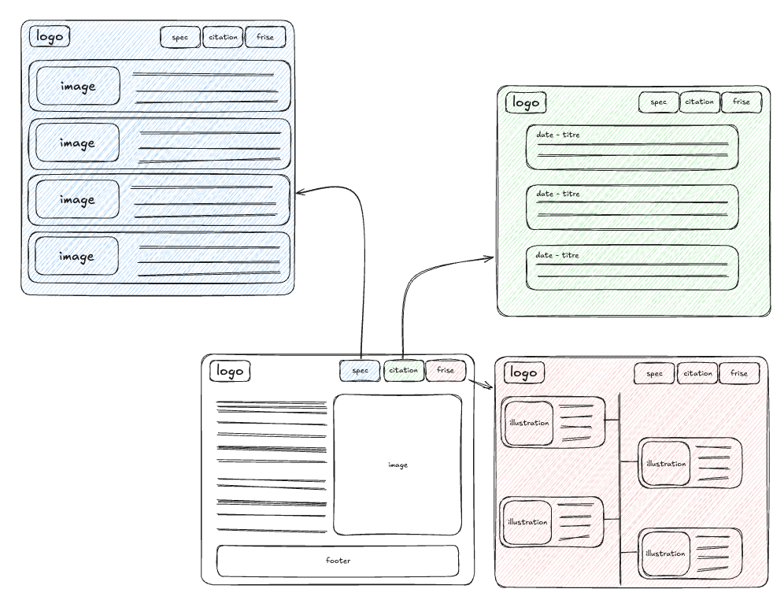
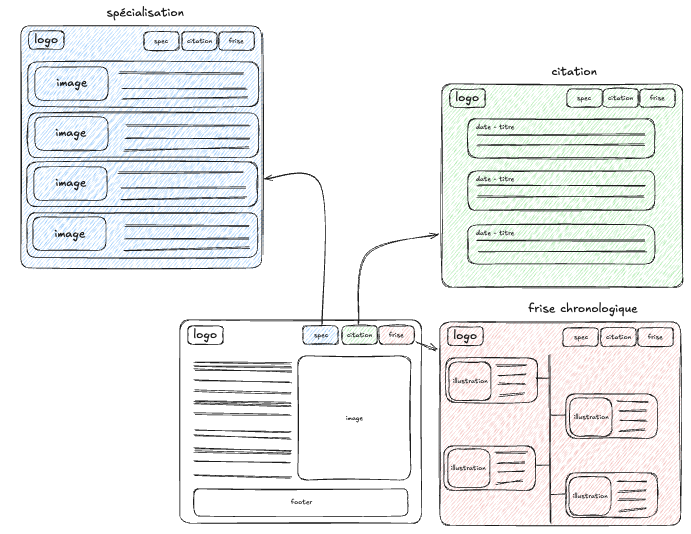
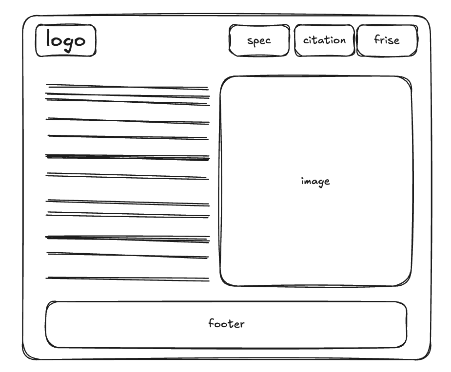

# ✅ Adapage

- **Durée :** 1 semaine
- **Type de projet :** seul / pair programming
- **Nom du repo :** `[nom_promo]-Adapage-[nom_github]`

## 📦 Modalités de rendu

Vous devez créer un repository avec comme nom `<tonpseudo>.github.io`, comme ça le site web sera créé automatiquement à l'url https://&lt;tonpseudo&gt;.github.io.

Vous pouvez développer en local sur votre ordinateur, mais pensez à push régulièrement sur la branche `main` du repository git.

> ⚠️ **Important :** Vous devez avoir _poussé_ (`git push`) votre **dernier commit à la date de rendu à minuit au plus tard**, afin qu’il soit pris en compte pour l’évaluation.

## 🎯 Objectif du projet

Nous allons développer un site web fait en html / css parlant d'une personnalité qui vous inspirent (elle peut être fictive ou réelle), si vous n'avez pas envie de la présenté et vous préférez vous concentrer sur le sujet vous pouvez récuperer l'une des personnalitées proposées :

1. Rosa Parks
2. Jeanne d'Arc
3. Marie Curie
4. Mulan
5. Simone Veil
6. Beyoncé

Votre page devra contenir :

- Une section de présentation (avec photo et description de la personne)
- Une section avec 4 cartes :
  - nationnalité
  - metier/activité
  - signe astro
  - meilleur qualité
- Une frize présentant les moments fort de sa vie
- Un témoignage / citation célèbre de cette personnalité
- Un footer
- Un menu de navigation avec un lien vers chaque section (intro, specificités, frize, temoignage)

## ⚙️ Initialisation du projet

Pour créer le projet, créer simplement un fichier `index.html` puis `style.css`, et si besoin tu peux également ajouter des images dans le dossier du projet.

Pour tester ton site en local, tu peux utiliser la commande `npx live-server`.

## 🧰 Pré-requis techniques

Pour mener à bien ce projet, il est nécessaire de maîtriser :

- les bases du **terminal**
- les bases de **HTML & CSS**

## 🧩 Fonctionnalités à développer

> ⚠️ **Réalisez toutes les fonctionnalités obligatoires avant de passer aux bonus.**

# 1.Homepage section

- [ ] Créer une page HTML avec une structure de base (head, body, sections, etc.)
- [ ] Ajouter l'image proposer ou une image de la personnalité choisie
- [ ] Ajouter une description de la personnalité choisie
- [ ] Styliser la page avec CSS pour améliorer l'apparence
      

# 2.Navigation

- [ ] Ajouter une barre de navigation avec des liens vers les sections de la page :
  - Frise chronologique
  - Témoignage / citation
- [ ] Styliser la barre de navigation avec CSS
- [ ] Pouvoir naviguer entre chaque section en cliquant sur les liens de la barre de navigation
      

# 3.Detail des sections

- [ ] Ajouter les informations dans chaque section :
  - votre présentation devra avoir une description de la personnalité choisie avec une illustration
  - votre frise chronologique devra contenir des événements importants de la vie de la personnalité
  - Ajouter les témoignages ou citations célèbres de la personnalité
  - Faire un footer regroupant toutes les informations de contact et votre github
    

## 🚫 Ce que vous ne devez pas faire

utiliser des frameworks CSS comme **Bootstrap ou Tailwind CSS** \
utiliser autre chose que **HTML et CSS** pour faire votre projet \
utiliser du **JavaScript** pour ce projet

## 💎 Bonus possibles

- [ ] Ajouter des animations CSS pour les images et les descriptions
- [ ] Ajouter un footer avec des liens vers vos réseaux sociaux
- [ ] Utiliser des polices personnalisées avec Google Fonts
- [ ] Ajouter un mode sombre / clair avec CSS
- [ ] Intégrer une vidéo youtube ou alors une carte google maps

## 📦 Modalité d'évaluation

L’évaluation se déroulera sous forme de démonstration. L'apprenante devra présenter une partie des fonctionnalités sur lesquelles iel a travaillé.

Chaque personne devra être capable :

- d’expliquer clairement son code à l’oral,
- de réaliser une démonstration fonctionnelle,
- de naviguer aisément dans son code durant la présentation.

Cette première partie durera **environ 5 minutes par personne**.

Ensuite, l'apprenante répondra à **une à deux questions techniques**, afin de vérifier ses compétences (basées sur le référentiel _Compétences à acquérir_ ci-dessous).
Cette phase durera **environ 2 minutes par personne**.

## 🎓 Compétences à acquérir

- [ ] Je sais créer une structure HTML de base
- [ ] Je sais ajouter des images et du texte dans une page HTML
- [ ] Je sais styliser une page web avec CSS
- [ ] Je sais rendre une page web responsive pour différents appareils
- [ ] Je sais definir et appliquer des styles CSS aux éléments HTML
- [ ] Je sais adapter mes balises à une taille d'écran différente
- [ ] Je sais utiliser la majorité des balises HTML de base (`
`, `<section>`, ``, `
`, `<h1>` à `<h6>`, etc.)
- [ ] Je sais gérer les marges, paddings et alignements avec CSS
- [ ] Je sais gérer ma barre de navigation et le footer de ma page

## 🎓 Soutenance

La soutenance du projet aura lieu le 10 février. Des créneaux vous seront proposés afin que vous puissiez choisir celui qui vous convient le mieux.
