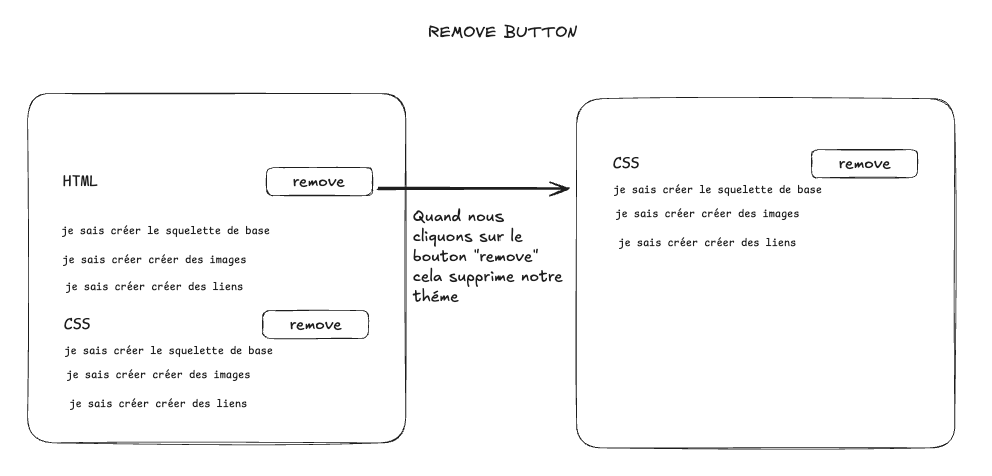
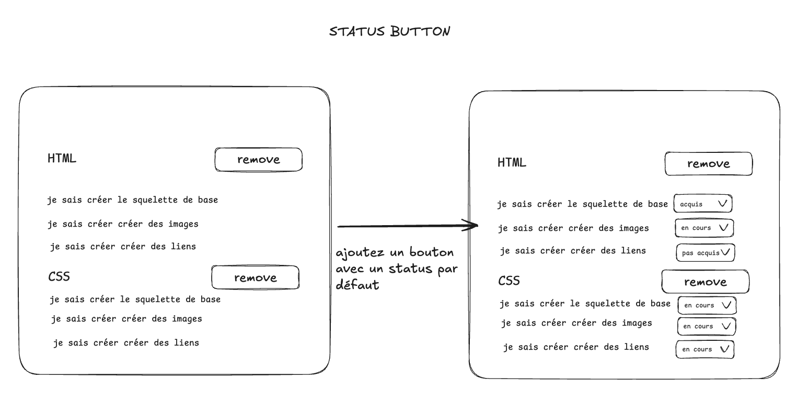
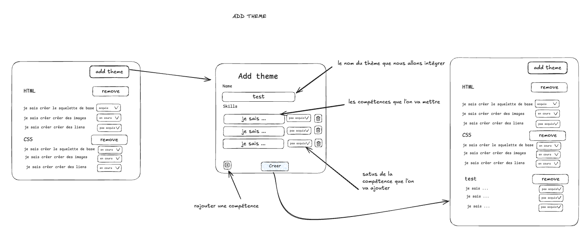
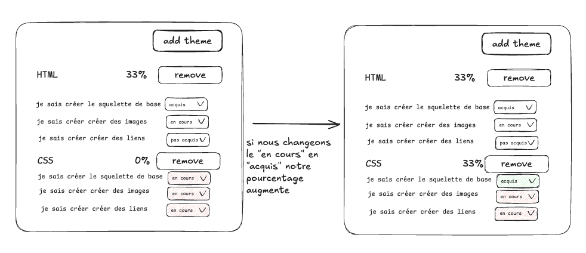

# ✅ Adashboard

- **Durée :** 1 semaine
- **Type de projet :** seul / pair programming
- **Nom du repo :** `[nom_promo]-adashboard-[nom_github]`

## 📦 Modalités de rendu

L'ensemble de l'exercice devra être _poussé_ (git push) sur la branche main du projet du git.

## 🎯 Objectif du projet

Ce projet a pour objectif de développer un tableau de bord (dashboard) en React permettant d’afficher et de visualiser des données fictives, qui représenteront par la suite vos compétences.
Ces données seront fournies par un backend ExpressJS, mis à votre disposition à l’adresse suivante :
https://github.com/Czecevic/adashboard_back

L’application devra récupérer les données depuis l'API fournie (votre dossier `back`), puis les afficher de manière claire et interactive dans le frontend React.

## 🧱 Stack technique (obligatoire)

| Élément            | Technologie | Lien                    |
| ------------------ | ----------- | ----------------------- |
| framework frontend | React       | https://fr.reactjs.org/ |
| environnement      | Node.js     | https://nodejs.org/     |

## ⚙️ Initialisation du projet

1. Ouvre un terminal dans votre dossier de vos projets
2. Crée le projet avec `pnpm create vite`
3. Sélectionne `React` pour le framework
4. Sélectionne `JavaScript` pour le langage
5. Installe les dépendances automatiquement
6. Utilise `cd <le_nom_de_votre_git>` pour aller dans le dossier, puis `code .` pour l'ouvrir dans VSCode

## 🧰 Pré-requis techniques

Pour mener à bien ce projet, il est nécessaire de maîtriser :

- les bases du **terminal**
- les bases de **PostgreSQL**
- les bases de **ExpressJS**
- les bases de **JavaScript**

## 🧩 Fonctionnalités à développer

> ⚠️ **Réalisez toutes les fonctionnalités obligatoires avant de passer aux bonus.**

## 1. Affichage des données dans notre front

> **un `themes` contient plusieurs `compétences`, chacune ayant un `status`**

- [ ] Mettre en place la logique pour récupérer les données depuis le backend Express fourni en utilisant `fetch`.
- [ ] Afficher les données récupérées en commençant par le nom du thème puis ses compétences
      
- [ ] Créer des composants React pour afficher les données récupérées :
  - un composant pour afficher le nom des thèmes
  - un composant pour afficher les compétences liées aux thèmes

## 2. Manipulation des données

- [ ] Mettez en place un bouton pour supprimer des `themes`
      (pensez à bien relancer votre neon pour récupérer les données supprimées)
      
- [ ] Faites en sorte de pouvoir modifier le `status` des `themes`
      
- [ ] Ajouter un bouton pour créer un `themes`
      
- [ ] Ajouter une partie pourcentage : celle-ci devra évoluer en fonction du nombre de compétences acquises dans un `themes`
      

## 🚫 Ce que vous ne devez pas faire

❌ Utiliser un autre framework frontend que React \
❌ Utiliser un backend autre que Express \
❌ Utiliser une base de données autre que PostgreSQL \
❌ Mettre en place une authentification utilisateur

## 💎 Bonus possibles

- [ ] Ajouter des graphiques pour visualiser les données (vous pouvez regarder charts)
- [ ] Ajouter React Router pour pouvoir gérer la navigation
- [ ] Ajouter des filtres pour afficher les `themes` en fonction de certains critères (par exemple, tirer par nom de A-Z ou Z-A)
- [ ] Modifier la base de données pour afficher des données plus personnelles (film, série, livre, jeu vidéo, etc.)
- [ ] Ajouter des animations pour améliorer l'expérience utilisateur

## 🎓 Compétences à acquérir

- [ ] Je comprends ce qu'est une base de données relationnelle
- [ ] Je sais expliquer ce qu'est le CRUD
- [ ] Je sais expliquer le fonctionnement d'une API RESTful
- [ ] Je sais comment intégrer du React avec un backend Express
- [ ] Je sais comment fonctionne les fonctions asynchrones
- [ ] Je sais utiliser les useEffect et useState dans React
- [ ] Je sais ce qu'est une prop dans React
- [ ] Je sais ce qu'est un state dans React
- [ ] Je sais ce qu'est un component dans React
- [ ] Je sais utiliser des fetch pour récupérer des données API
- [ ] Je sais manipuler du CRUD directement via mon front en utilisant fetch
- [ ] Je sais utiliser une progress bar pour afficher un pourcentage de progression

## 🎓 Soutenance

X aucune soutenance n'est prévue pour ce projet
