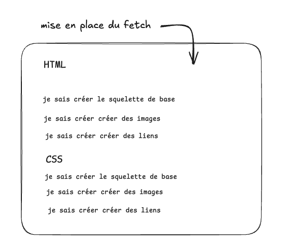
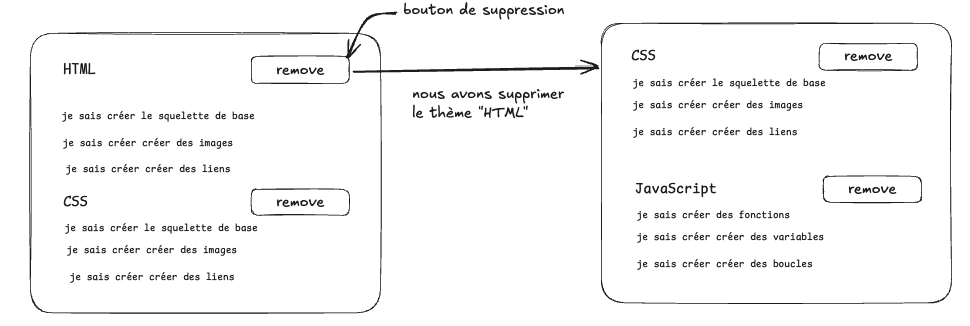
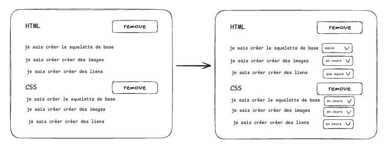
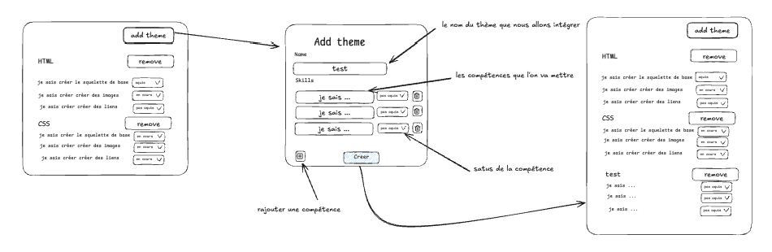
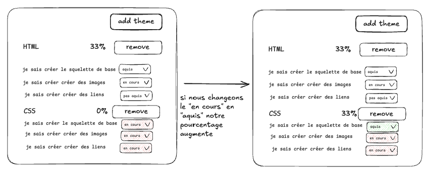

# ✅ Adashboard

- **Durée :** 1 semaine
- **Type de projet :** seul / pair programming
- **Nom du repo :** `[nom_promo]-adashboard-[nom_github]`

## 📦 Modalités de rendu

TODO: préciser en fonction de l'avancement sur git

> ⚠️ **Important :** Vous devez avoir _poussé_ (`git push`) votre **dernier commit à la date de rendu à minuit au plus tard**, afin qu’il soit pris en compte pour l’évaluation.

## 🎯 Objectif du projet

Ce projet a pour objectif de développer un tableau de bord (dashboard) en React permettant d’afficher et de visualiser des données provenant de votre backend ExpressJS (le backend vous sera fournis via ce lien : https://github.com/Czecevic/adashboard_back) . \
L’application devra se connecter à votre base de données, récupérer les données nécessaires, et les afficher de manière claire et interactive.

## 🧱 Stack technique (obligatoire)

| Élément            | Technologie | Lien                    |
| ------------------ | ----------- | ----------------------- |
| framework frontend | React       | https://fr.reactjs.org/ |
| environnement      | Node.js     | https://nodejs.org/     |

## ⚙️ Initialisation du projet

1. Ouvre un terminal dans votre dossier de vos projets
2. Crée le projet avec `pnpm create vite`
3. Sélectionne `React` pour le framework
4. Sélectionne `JavaScript` pour le langage
5. Installe les dépendances automatiquement
6. Utilise `cd <le_nom_de_votre_git>` pour aller dans le dossier, puis `code .` pour l'ouvrir dans VSCode

## 🧰 Pré-requis techniques

Pour mener à bien ce projet, il est nécessaire de maîtriser :

- les bases du **terminal**
- les bases de **PostgreSQL**
- les bases de **ExpressJS**
- les bases de **JavaScript**

## 🧩 Fonctionnalités à développer

> ⚠️ **Réalisez toutes les fonctionnalités obligatoires avant de passer aux bonus.**

## 1. Affichage les données dans notre front

- [ ] Mettre en place la logique pour récupérer les données depuis le backend Express fournis en utilisant `fetch`.
- [ ] Afficher les données récuperées par celui-ci en commencant par le nom puis les compétences
      
- [ ] Créer des composants React pour afficher les données récupérées :
  - un composant pour afficher le nom des thèmes
  - un composant pour afficher les compétences liées aux thèmes

## 2. Manipulation des données

- [ ] Mettez en place un bouton pour supprimer des `themes`
      (pensez à bien relancer votre neon pour récuperer les données supprimées)
      
- [ ] Faites en sorte de pouvoir modifier le `status` du dis `themes`
      
- [ ] Rajouter un bouton pour créer un `themes`
      
- [ ] rajouter une partie pourcentage, elle devra augmenter en fonction du nombre de `aquis` dans le `themes`
      

## 🚫 Ce que vous ne devez pas faire

❌ Utiliser un autre framework frontend que React \
❌ Utiliser un backend autre que Express \
❌ Utiliser une base de données autre que PostgreSQL \
❌ Mettre en place une authentification utilisateur

## 💎 Bonus possibles

- [ ] Ajouter des graphiques pour visualiser les données et améliorer
- [ ] Ajouter des filtres pour afficher les dashboards en fonction de certains critères (par exemple, par date de création)
- [ ] Modifier la base de données pour afficher des données plus personnelles (film, série, livre, jeu vidéo, etc.) => vous pouvez dire si ce film remplit un certain nombre de "tâches" alors c'est un bon film !
- [ ] Ajouter des animations pour améliorer l'expérience utilisateur

## 🎓 Compétences à acquérir

- [ ] Je comprends ce qu'est une base de données relationnelle
- [ ] Je sais configurer une base de données PostgreSQL avec Docker
- [ ] Je sais expliquer ce qu'est le CRUD
- [ ] Je sais expliquer le fonctionnement d'une API RESTful
- [ ] Je sais configurer une connexion à une base de données PostgreSQL depuis un backend Express
- [ ] Je sais comment intégrer du React avec un backend Express
- [ ] Je sais utiliser les useEffect et useState dans React
- [ ] Je sais ce qu'est une prop dans React
- [ ] Je sais ce qu'est un state dans React
- [ ] Je sais ce qu'est un component dans React
- [ ] Je sais utiliser des fetch pour récupérer des données API
- [ ] Je sais comment fonctionne les fonctions asynchrones
- [ ] Je sais manipuler du CRUD directement via mon front en utilisant fetch
- [ ] Je sais utiliser une progress bar pour afficher un pourcentage de progression

## 🎓 Soutenance

X aucune soutenance n'est prévue pour ce projet
